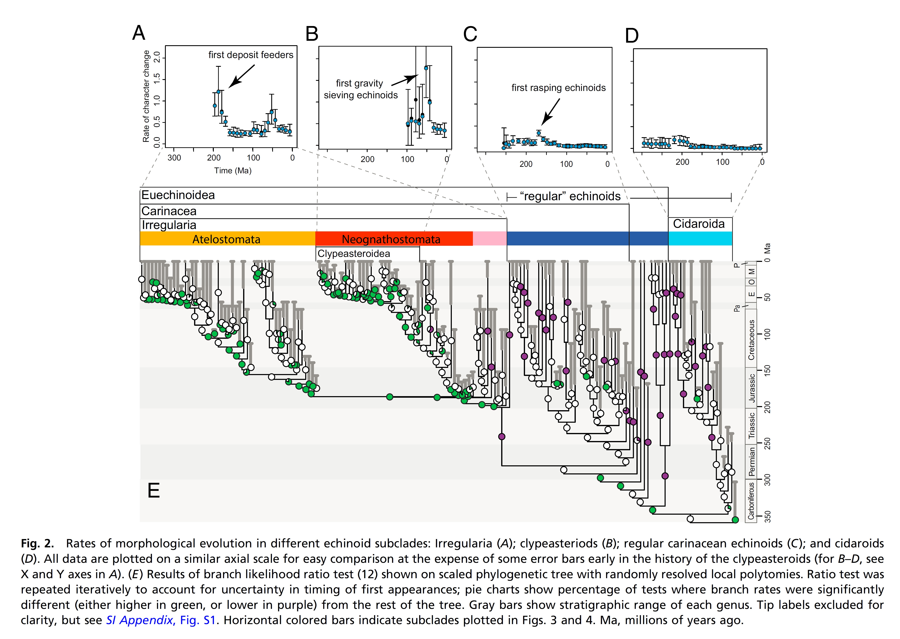

Welcome to our workshop!

Presumably we'll have more to say, eventually.

For now, enjoy these pictures...

## Trees Through Time

Have you ever thought about how phylogenies and our depictions of them have evolved?

_Genealogical Tree of Dead and Living Languages, by Félix Gallet (c. 1800)_

Look at that! A phylogeny of languages, more than 50 years before Darwin will publish the Origin of Species!

_'Paleontology' foldout-chart, from Hitchcock 1840_

Another pre-Darwinian phylogeny, this time actually of organisms.

_Tree of Life (Haeckel, 1898)_

_Haeckel, 1905, The Evolution of Man_

Okay, that's enough from Ernst Haeckel for now...

 after Zimmerman %281938%29, p328_of_A_century_of_progress_in_the_natural_sciences %281955%29.jpg)

What is it about paleontology and combining spindle diagrams with trees?

_Dated Phylogeny of Fossil Echinoids from Hopkins & Smith, 2015, PNAS_

_Dated Phylogeny of Mesozoic Dinosaurs from Lloyd et al. 2016_

## The Power of Trees

Trees are really useful!

Huang et al., 2015, PNAS, Fig 1D: This figure shows the effect of ancestor-descendant relationships on the measuring of phylogenetic diversity and the impact of extinction.

Deline et al. 2018 - Phylomorphospace of All Animals, Gray Polygon is Space Occupied by Cambrian Animals.

Are you excited yet?
