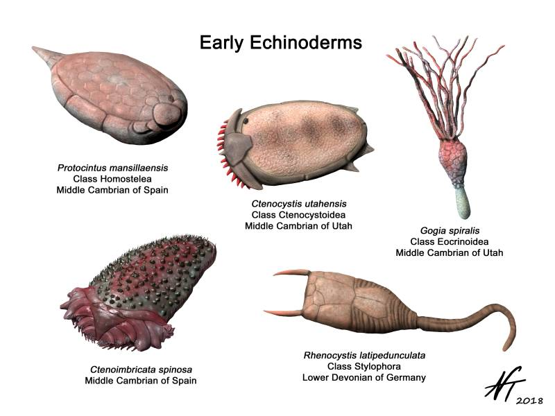

Explaining what cinctans are and why echinoderms are cool

# Echinoderms are Weird

If you didn't already know too much about echinoderms, it is now too late, the doors are locked, there is no escape, the Ambulacra will have you at all costs.

Some of these are cinctans.