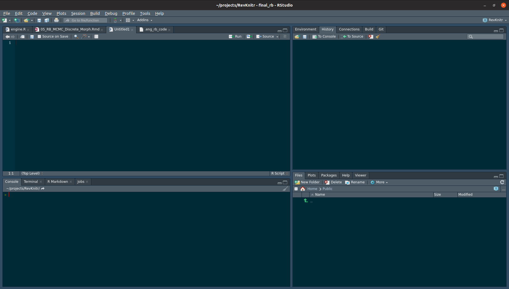

# Using RStudio

Many RevBayes users may want to use RevBayes through RStudio, a popular graphical interface for R.
R is a fairly common computing language in biology.
In this section of the tutorial, we will focus on running RevBayes from RStudio. Once you've followed the RStudio instructions on the installs page, you can run use Rev language as you would in a standard RMarkown document.

RStudio has an interface with four panes: the editor (upper left), console (lower left), environment (upper right), and files (lower right).
This can be seen below





In the upper-right hand panel, start a new RMarkdown document. RMarkdown is used via "chunks", or  lines of code. In a new RMarkdown notebook, the first cell is shown in {% ref markdownsetup}


We will edit this cell to add two variables, the root directory and the engine.path. The working directory tells R what directory you want to work in. We will set this equal to the directory to which we downloaded the data and scripts. For example, if the directory structure if as shown in figure , this line will be `knitr::opts_chunk$set(root.dir = "~/projects/tutorials/tutorial_structure/)` on Mac and Linux. On PC, it will be `setwd("c:\\april\\tutorials\\tutorial_structure")`.

The engine.path is where RevBayes is on your computer. If my copy of RevBayes is in a directory called "software" in my user home, my enine path will be `knitr::opts_chunk$set(engine.pat="~/software/rb")` on Mac and Linux or `knitr::opts_chunk$set(engine.pat="c:\\april\\software\\rb")` on PC.

The appearance of the setup cell can be seen below.


Run this chunk by clicking the green arrow in the upper-left hand corner of the cell.

Next, you will note other RMarkdown chunks in the document. By changing the `r` in the curly braces to `rb`, we can run RevBayes in a markdown document. By choosing `r` or `rb`, we cna use both the R programming language and RevBayes in the same notebook.


Create a new RevMarkdown chunk as show above. Into this cell, we will paste the following code:

```{rb}
variable <- "Hi there! Welcome to RevBayes! I am now going to read in some test data."

variable
```

Run it by clicking the green arrow. If this execute correctly, you will receive the message.

```
   Processing file "scripts/test.Rev"
   Hi there! Welcome to RevBayes! I am now going to read in some test data.
```


Now, we'll actually read in the data. Start a new Markdown chunk and enter:

```
molecular <- readDiscreteCharacterData("data/example_file.nex")

success <- "Congratulations, you set up your scripts and code directories correctly."

success
q()
```

If this executes correctly, you will receive the output:

```
   Successfully read one character matrix from file 'data/primates_and_galeopterus_cytb.nex'
   Congratulations, you set up your scripts and code directories correctly.
```

If you have made a mistake and need to erase previous output, you can add a flag to the markdown cells that refreshes previously-entered commands, as shown in figure .


Lastly, the entire document can be `knitted` to an output file. At the top of your screen, there is a button labeled Knit. This allows you to run all of your code and save the text, output, and figures to html, PDF, and other formats.
