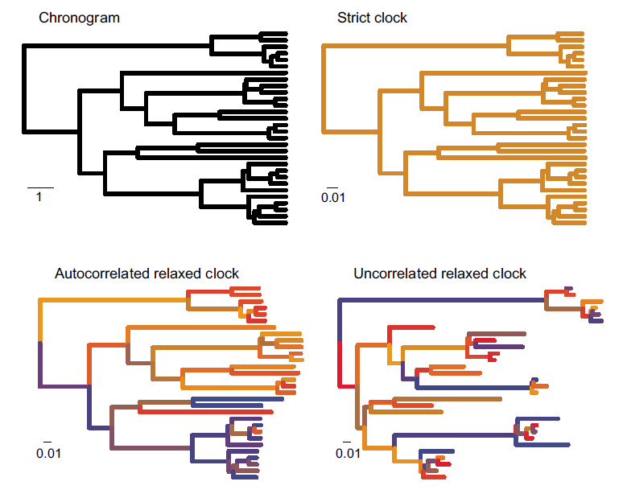

# Introduction  

One of the great strengths and unique perspectives of paleontology among evolutionary sciences is its temporal dimension. For this reason, fossils have long played a role in dating the Tree of Life, yet most paleontological studies inferring phylogenies of extinct species do not include this potentially important element. However, with the advent of Bayesian tip-dating methods, paleontologists have increasingly begun to incorporate time directly into their analysis to estimate divergences times and/or phylogenetic relationships of extinct lineages. The clock models used in these methods play an important role in disentangling rates and time. This issue is particularly relevant to us paleontologists because many of our most treasured hypotheses and far-reaching insights revolve around knowledge of the timing or rate of change during major events in the history of life. 

This tutorial will give an overview of time tree analyses, clock models of morphological evolution, and assumptions when estimating time-calibrated phylogenies of extinct clades. The analysis will be conducted on morphological characters and fossil occurrence data using a clade of extinct, cinctan echinoderms that diversified throughout the middle Cambrian Period (~ 497 Ma - 509 Ma). 

## Unconstrained trees vs. time trees

This tutorial is about morphological clock models for paleontological data. Many commonly used phylogenetic methods in paleontology, such as maximum parsimony or undated Bayesian phylogenetic analysis (e.g., in MrBayes), do not incorporate time and therefore do not use clock models. We refer to branch lengths derived from such methods as *unconstrained* because time and rates are confounded. 


*Figure 1. In an undated phylogenetic analysis, the branch lengths are said to be unconstrained because they reflect the product of the morphological rates and time (left). In contrast, tip-dating and similar methods incorporate clock models of character change and temporal information from the fossil record to scale branch lengths in units of time (right).*

\newpage

To see why this is the case, consider how branch lengths are defined in unconstrained analyses. Under parsimony, branch lengths may relate to the number of parsimony "steps" (# of character changes) along branches, whereas in model-based methods branch lengths reflect the mean number of "substitutions" (i.e., character state transitions) per "site" (i.e., morphologic characters). In both cases, the intuition is the same: longer branches indicate more changes have occurred. However, it is impossible to disentangle rates from time without additional information. For example, if a branch is "long" (i.e., it has experienced many evolutionary changes), is it because that lineage is characterized by higher rates of evolution? Or did that lineage just have longer to evolve and accumulate character changes? 

Methods that involve estimating divergences, such as fossil tip-dating, aim to co-estimate branch durations (in units of time) and branch rate (in units of expected changes per character). This requires three important ingredients: (1) external, geological information, primarily in the form of **fossil occurrence times**; (2)  a **clock model** that describes how character change is distributed throughout the tree, and (3) a **tree prior** model. Although we will use all three ingredients in this tutorial, you'll learn more about tree prior models in the next module. 


## "Clock" models apply to morphological characters

Clock models are essential in divergence dating analyses because they describe how rates of character change varies (or does not vary) across the phylogeny. Although clock models originate from biological literature concerning the "molecular clock", from a modeling perspective it does not matter whether our data are molecules or morphology. In a remarkable analysis (at least I think it is!), Lee et al. (2013) applied molecular and morphological clock models to a combined dataset of molecular and morphological data of extant arthropods (no fossils were included as tips in their tree). They found evidence that rates of morphological evolution were higher during the Cambrian than other times throughout the Paleozoic. It's fascinating to see how molecular and morphological clock models can be used to test a predominately paleontological hypothesis (i.e., the Cambrian "explosion") with extant taxa alone! Do you think their results would change if morphological data from fossils were included? Why or why not?


*Figure 2. Results of molecular and morphological clock analysis of extant arthropods. From Lee et al. (2013).*

Although the Lee et al. (2013) example involved extant species, morphological clock models can also be used to test macroevolutionary hypotheses of entirely extinct clades. Examples of such studies are numerous and span a diverse array of taxa and timescales, including fossil hominids (Dembo et al., 2015), Mesozoic mammals (Close et al., 2015), Paleozoic crinoids (Wright, 2017a), Cambrian trilobites (Patterson et al., 2019), and many other studies. 


# A Brief Classification of Clock Models

There are many kinds of clock models described in the literature (see Lepage et al., 2007; Heath and Moore, 2014; Ho and Duchene, 2014). We will only mention a few here. All clock models can be placed into two categories: **strict clock** and **relaxed clocks**, which is equivalent to saying "strict clock" vs. "everything else". A strict clock assumes a *constant rate* of evolution whereas relaxed clocks apply a model of *rate variation*. The distinction here between strict and relaxed clocks is broadly similar to other paleontological pursuits that use either a "set rate" or "distributed rate," such as models of taxonomic diversification and methods accounting for incomplete sampling over time or spatial scales.

* **Strict Clock**

The strict clock model is the most simple clock model. It assumes that all branches follow a single, constant rate of morphological evolution. Although this may strike you as overly simplistic (and you might not be wrong!), some studies have found a surprising degree of concordance with fossil data fitting a strict morphological clock even when models incorporating rate variation provide a better statistical fit (Wright, 2017b; Drummond and Stadler, 2016). The strict clock model has one advantage in its simplicity: it adds only one parameter to the analyses, whereas relaxed clock models require many additional parameters. Depending on the size and degree of rate variation, it is entirely possible strict clock models could be preferred in some paleontological datasets, especially in cases where rate variation among lineages is low.

* **Relaxed Clock**

Relaxed clocks form a family of models that differ in their underlying assumptions about how rates are distributed throughout the tree. These include:

+ Uncorrelated rates

+ Autocorrelated rates

+ Local clocks and mixture models

**Uncorrelated rates.** Sometimes referred to as "independent rate models" in the literature, uncorrelated models account for rate variation by assuming each branch has its own, independent rate drawn from a shared underlying probability distribution. A biological interpretation of an uncorrelated model suggests that evolutionary rates in ancestral lineages do not influence rates in descendants. Moreover, rates of evolution may change episodically throughout the tree but are "branch-wise," meaning change is only modeled as occurring at lineage splitting events (Heath and Moore, 2014). How many paleontological hypotheses can you think of invoke some degree of episodic or punctuated change? Uncorrelated models are very commonly applied in the literature and their assumptions and biological implications will be discussed further in the section below called "The Uncorrelated Lognormal Relaxed Clock."

**Autocorrelated rates.** Do closely related lineages have similar rates of morphological evolution? This might be particularly true for study systems where closely related species have similar intrinsic biological factors (population size and dynamics, generation time, etc.). Autocorrelated models incorporate a degree of rate inheritance across the tree from ancestor to descendants. Commonly, this is done by drawing branch rates for descendant lineages from a probability distribution centered on the ancestral rate (Heath and Moore, 2014). In contrast with uncorrelated models, autocorrelated clock models can be either "branch-wise" or continuous depending on whether one is modeling evolutionary change as a function of time or per-lineage shifts. Can you think of traits in the paleontological literature that might exhibit "heritability" over geological timescales?

**Local clocks and mixture models.** These models offer a compromise between setting an "all rates equal" vs. "all rates different" end members of the strict vs. uncorrelated clock models. For example, unlike uncorrelated clock models that draw independent rates for each branch, mixture models categorize subsets of branches into distinct rate classes. Because the number of rate classes is typically far fewer than the number of branches, these models commonly require fewer parameters to estimate. The Dirichlet Process Prior described by Heath et al. (2012) is an example of a mixture model in the literature.

**Other models.** There are many other ways to model morphological rate variation among lineages. With access to modular software like RevBayes, we can create nearly any clock model we can dream up. For instance, another way to relax the clock could involve modeling branch rates as either "decaying" over time or time-specific shifts.  "Early Burst" models of morphological diversification, whereby morphologic character changes are concentrated early in the history of a clade, are one example of a time-varying model. 


*Figure 3. Phylogenetic trees showing differences in how rate variation is distributed across different clock models. Although this example uses extant species, the same logic applies to paleontological phylogenies. (Upper left), chronogram where branch lengths are in units of time. The scale bar is 1 time unit. All other panels show clock models with branch lengths measured in number of molecular substitutions per site (analogous to character changes for morphologic data). Figure modified from Ho and Duchene (2014).*


# Example: Applying a Relaxed Morphological Clock Model 

In this tutorial, we will apply an uncorrelated lognormal relaxed clock model to infer a time-calibrated phylogeny of cinctan echinoderms.


**Data and Files**

>In the previous module, you should have created a directory called **PaleoSoc_phylo_short_course_2019**. The data you will need for this tutorial should be in the subdirectory **data** and it should contain the following two files: [`Cinctans_for_RevBayes.nex`](data/Cinctans_for_RevBayes.nex) and [`cincta_fossil_intervals_FA.tsv`](data/cincta_fossil_intervals.tsv).


**Load Data Matrices**

In RevBayes, use the function `readDiscreteCharacterData()` to load the cinctan matrix to the workspace and assign it to the variable `morpho`. 


```{rb}
    morpho <- readDiscreteCharacterData("data/Cinctans.nex")
```


**Load Fossil Age Data**

RevBayes uses the function `readTaxonData()` to load fossil age data to the workspace from a formatted file. Import the fossil age data and assign it to the variable `taxonData`. 


```{rb}
    taxonData <- readTaxonData(file="data/cincta_fossil_intervals_FA.tsv")
```

This file contains the names of each species in the dataset and the approximate time of their first appearance, according to their occurrences in trilobite biostratigraphic zones. This is the First Appearance Datum, or FAD, for each species. If you examine the dates in the .tsv file, you may notice these ages do not look like they represent accurate ages for Cambrian echinoderms. They do--sort of. We'll get to what they represent later when setting a prior distribution on the tree age. 

Although we're using the approximate time of first appearances for this analysis, please note that this assumption is not required by RevBayes and may not be appropriate for all (or even most) paleontological datasets! In fact, you can place a probability distribution on fossil occurrence times, such as a uniform distribution, or even incorporate the stratigraphic range of a taxon directly into the analysis. But in this example, keep in mind we're using FADs to constrain fossil ages.


**Create Helper Variables and MCMC move iterators**

Recall in the previous module we had to create helper variables that are used in our MCMC analysis, but are not model parameters. We will assign these variables with the constant node assignment operator, `<-`. Even though these values are used in our scripts, they are not parameters of the model. 

We will first create a constant node called `num_taxa` that is equal to the number of species in our analysis. We will also create a constant node called `num_branches` representing the number of branches in the tree, and one of the taxon names. This list will be used to initialize the tree.

```{rb}
    # Get the names and number of species in the analysis
    taxa <- morpho.names()
    num_taxa <- morpho.size() 
    # Number of branches in a rooted tree = 2*(number of taxa) - 2
    num_branches <- 2 * num_taxa - 2
```

Next, we need to set up workspace variables called `mvi` and `mni` to use as iterators during the MCMC analysis.

```{rb}
    # MCMC iterator variables
    moves = VectorMoves()
    monitors = VectorMonitors()
```


**Place a prior on the root age of the tree**

Because this analysis will use temporal data to co-estimate divergence times and phylogenetic relationships, we need to specify a prior distribution for the origin of our focal clade (i.e., the root age of the tree). 

Cinctan echinoderms occur throughout middle Cambrian (Miaolingian) rocks, so the clade must have diverged at some point earlier in time. But how much earlier did they diverge? Because we do not know with certainty or have any other information on their divergence (and because this workshop is focused on RevBayes), we're going to be good Bayesians and treat the root age of the tree as a random variable that we can estimate. Estimating the root age will add an additional parameter to the analysis.

Node ages for time-calibrated trees are intuitive: they increase from the tips toward the root (i.e., backwards in time), with the root being the oldest node in the tree. However, it is important to note that in RevBayes, the "end" of the tree generating process ends at time, _(t)_ = 0. This makes sense for analyses including extant species because the youngest time unit is the present day. For paleontologists, this is awkward because many of us study lineages that are completely extinct, such as for cinctan echinoderms. However, it is straightforward to rescale our age dates relative to the end of time of interest.

The youngest taxon in our analysis is *Sucocystis acrofera*, which has its FAD at ~498.8 Ma. Since this is the youngest occurrence in the analysis, we can effectively treat it as "extant". To obtain the dates listed in the variable `taxonData`, we rescaled the absolute ages such that RevBayes treats *Sucocystis acrofera* as "extant" (i.e., 498.8 Ma = 0 Ma). 

Given their fossil record, cinctans diverged from other echinoderms by at least the middle Cambrian Miaolingian Series, but probably do not have "deep" roots in the early Cambrian or Precambrian. We will place a uniform distribution on the root age to correspond to Cambrian *Stage 4*, spanning 509 Ma to 514 Ma. Rescaling these to relative time units, we find 509 Ma = 10.2 Ma and 514 Ma = 15.2 Ma.

```{rb}
    origin_time ~ dnUnif(10.2, 15.2);
    # Set MCMC move on the parameter
    moves.append(mvSlide(origin_time, delta=0.01, weight=4))
    # Set up a monitor for the root age of the tree
    Root_age := origin_time
```


Although these rescaled ages may seem awkward to us paleontologists accustomed to working in units of absolute time, note that the relative timescale (in millions of years), and therefore the relative divergences, are unchanged by this translation. Moreover, the divergence times can be rescaled back to their correct absolute time after the analysis. For example, if the root age of the cinctan tree was estimated to be 14.8 Ma on the relative scale, the "corrected" root age would be 14.8 Ma + 498.8 Ma = 513.6 Ma. 


**Place a prior distribution on the tree**

Now that we have a prior on the root age, we need to place a prior distribution on the tree topology. We'll use the function `dnUniformTimeTree()` to set a time tree prior that is a function of the root age and places equal probability on all possible phylogenies.
    
```{rb}
   phylogeny ~ dnUniformTimeTree(rootAge=origin_time, taxa=taxa)
```

Next, we will place MCMC moves on both the topology and node ages of the time tree, as well as set a deterministic node to monitor the tree length.

```{rb}
   # Set MCMC moves for tree topology
   moves.append(mvFNPR(phylogeny, weight=num_branches/2.0))
   moves.append(mvNNI(phylogeny, weight=num_branches/2.0))
  
   # Set MCMC moves for node ages
   moves.append(mvNodeTimeSlideUniform(phylogeny, weight=num_branches/10))
   moves.append(mvRootTimeSlideUniform(phylogeny, origin_time, weight=5))

   # Set MCMC monitor for tree length
   tree_length := phylogeny.treeLength()
```

The uniform time tree prior, which considers all possible tree topologies to be equally likely, is very simplistic and *makes very unrealistic assumptions about fossil sampling*. In the next module, Tripartite Model 3: Fossilized Birth Death, you will learn more about tree priors and how to incorporate paleontologically-inspired methods into your analysis, such as integrating diversification and/or sampling through time. So you'll hear more on this topic later!


**Place a prior distribution on Mk model: rate variation among characters**

We will be using the Mk model of morphological character evolution, which we will specify further below. For now, we will set up a Gamma-distributed rate variation to the Mk model and specify moves on the parameters of the Gamma distribution. 

```{rb}
    alpha_morpho ~ dnUniform( 0, 1E6 )
    rates_morpho := fnDiscretizeGamma( alpha_morpho, alpha_morpho, 4 )
    #Moves on the parameters to the Gamma distribution.
    moves.append(mvScale(alpha_morpho, lambda=1, weight=2.0))
```

As discussed in the previous module, this allows for rate variation *among characters* (i.e., different characters may evolve at different rates). Next, we will set up a clock model that allows for rate variation *among lineages*.


## The Uncorrelated Lognormal Relaxed Clock

The uncorrelated lognormal (UCLN) relaxed clock model assumes rate heterogeneity across branches and models this process by drawing independent and identically distributed branch rates from an underlying lognormal distribution. Although rates are drawn from the same underlying distribution, the rate of evolution along a particular branch does *not* depend on other branches in the tree, including its ancestor or close relatives. 

Like other independent rate clock models, rates in the UCLN model vary in a "branch-wise" manner, meaning that change is modeled between branches rather than within branches. Consequently, this model might be particularly attractive to paleontologists interested in "punctuated" morphological change. Further, independent rate models like the UCNL allow for episodic change to occur anywhere throughout the tree. This aspect of the model may help account for instances where a lineage (or subset of lineages) experience "bursts" of morphological evolution, such as if a subclade undergoes adaptive radiation or if extrinsic factors lead to unusually high (or low) rates through time (Hopkins and Smith, 2015; Wright, 2017a) Even in lineages where morphological evolution may have been "gradual" (i.e., slow and continuous), the protracted temporal scales over which paleontologists commonly sample taxa may give rise to substantial morphologic variation among sampled lineages. In such cases, uncorrelated models may provide good  parameter estimates even though the underlying generation-to-generation evolutionary dynamics were gradualistic. 

**Introduction to the lognormal distribution**

A wide variety of probability distributions are available to choose from when choosing an uncorrelated clock model (e.g., lognormal, gamma, exponential distribution), and the modularity of RevBayes allows you to be very flexible with your choice. However, because different distributions correspond to different assumptions the underlying process of rate variation, it's a good idea to consider the implications your choice.
 
Why use the lognormal distribution? The lognormal has a few nice properties: (1) it's a distribution of positive values (can evolutionary rates be negative?); (2) it can assume a wide variety of different shapes, making it useful for describing a wide variety of of data; and (3) lognormal distributions often arise as a multiplicative product of independent variables. If the factors that underly rate differences in morphological evolution are the product of multiple probabilistic processes (Wagner, 2011), then the lognormal might be expected to be a useful distribution for modeling morphological data.

A lognormal distribution is parameterized by $\mu$ and $\sigma$, which describe the location and scale of the distribution. The parameters of a lognormal distribution could be either fixed or estimated as part of the analyses. In most instances, we don't have information on how best to parameterize the lognormal distribution. Because we don't know what these parameters should be for our cinctan data, we will treat them as *hyperpriors* so we can sample a mixture of lognormal distributions during MCMC analysis.

**Setting hyperpriors on the clock rate**

Because it can be difficult to interpret a hyperprior placed on the location parameter $\mu$, it is preferable to place a hyperprior on the mean $(M)$ of the lognormal distribution (Heath and Moore, 2014). The expected value (i.e., the arithmetic mean) of a lognormally distributed random variable is related to the location and scale parameters by:

$$M = e^{\mu +\frac{\sigma^2}{2}}. $$ 

Here, we'll set hyperpriors by assuming that both $M$ and $\sigma$ follow an exponential distribution. Then, we'll set a deterministic node to monitor $\sigma^2$. 

```{rb}
    # M
    ucln_mean ~ dnExponential(2.0)
    # sigma
    ucln_sigma ~ dnExponential(3.0) 
    # Set a deterministic node on sigma^2 
    ucln_var := ucln_sigma * ucln_sigma 
```

Now that we've placed hyperpriors on $M$ and $\sigma^2$, we can rearrange the equation above in terms of $\mu$,

$$\mu = ln(M) - \frac{\sigma^2}{2}.$$ 

Using this relationship, we can set a deterministic node that records the parameter $\mu$ of the lognormal distribution. 

```{rb}
    # set deterministic parameter giving mu on branch rates
    ucln_mu := ln(ucln_mean) - (ucln_var * 0.5)
```

As usual, we need to set MCMC moves on parameters. In this case, because $\mu$ is a function of $M$ and $\sigma$, we need to place MCMC moves on these parameters.


```{rb}
    # Set MCMC moves
    moves.append(mvScale(ucln_mean, lambda=1.0, tune=true, weight=4.0))
    moves.append(mvScale(ucln_sigma, lambda=0.5, tune=true, weight=4.0))

```

\newpage
**Assigning rates to branches**

Now, we have all the relevant parameters for drawing branch rates. Using $\mu$ and $\sigma$, we can write a loop to draw a rate for all branches in the tree. In the loop, we'll place the branch rates in a vector called `branch_rate_var` and set a MCMC move to tune the branch rates.


```{rb}
    # assign rates to branches and add mcmc move
    for (i in 1:num_branches){
        branch_rate_var[i] ~ dnLognormal(ucln_mu, ucln_sigma)
        moves.append(mvScale(branch_rate_var[i], lambda=1, tune=true, weight=2.0))
    }
```

We've already placed a MCMC move on branch rate variation, but it is often helpful to place additional moves to improve MCMC mixing and obtain better parameter estimates. Let's add two additonal moves. 

```{rb}
    # As usual, we need to set MCMC moves on these parameters.
    moves.append(mvVectorScale(branch_rate_var,lambda=1.0,tune=true,weight=2.0))
    moves.append(mvVectorSingleElementScale(branch_rate_var,lambda=30.0,tune=true,weight=1.0))
```


## Putting it all together

Finally, we combine each the Mk model of character evolution, gamma-distributed rate heterogeneity (describing variation among characters), the uncorrelated relaxed clock model (describing variation among lineages), and the uniform tree model together into a `phyloCTMC` object. The following loop will apply these model parameters to all morphological character partitions with the same number of states.

```{rb}
n_max_states <- 3
idx = 1
morpho_bystate[1] <- morpho
for (c in 1:n_max_states) {
    # make local tmp copy of data
    # only keep character blocks with state space equal to size i
    morpho_bystate[c] <- morpho
    morpho_bystate[c].setNumStatesPartition(c)
    nc = morpho_bystate[c].nchar()
    # for non-empty character blocks
    if (nc > 0) {
        # make i-by-i rate matrix
        q[idx] <- fnJC(c)
        # create model of evolution for the character block
        m_morph[idx] ~ dnPhyloCTMC(tree=phylogeny,
                                Q=q[idx],
                                nSites=nc,
                                siteRates=rates_morpho,
                                branchRates=branch_rate_var,
                                type="Standard")
        # attach the data
        m_morph[idx].clamp(morpho_bystate[c])
        # increment counter
        idx = idx + 1
  }
}
```


Note that this script is very similar to the one used in in the previous module (Tripartite Model 1 - Discrete Morphology). Can you spot the difference? It's subtle, but very important!

Now that all of the components of the model are specified, we can run an analysis!

## Complete MCMC Analysis

**Create Model Object**

Create our workspace model variable with the `model()` function and provide a single node in the graph (`phylogeny`).

```{rb}
    mymodel = model(phylogeny)
```


**Specify Monitors and Output Filenames**

We often want to monitor every named random variable in our model graph. This step will write all numerical parameters to a tab-separated text file that can be opened by other programs for evaluating parameters and assessing convergence. We will also name the
output file and state how often we would like to record parameter values.


```{rb}
    monitors.append(mnModel(filename="output/ucnl_relaxed_clock.log", printgen=10))
```

We use the function `mnFile()` to save phylogenies sampled in the analysis.

```{rb}
    monitors.append(mnFile(filename="output/ucln_relaxed_clock.trees", printgen=10, phylogeny))
```

If you're like me, you'll want to print information to the screen to monitor the results as the MCMC is running.

```{rb}
    monitors.append(mnScreen(printgen=100))
```

### Set-Up the MCMC

Once we have set up our model, moves, and monitors, we can now create the workspace variable that defines our MCMC run. We do this using the `mcmc()` function that simply takes the three main analysis components as arguments.

```{rb}
    mymcmc = mcmc(mymodel, monitors, moves, nruns=2, combine="mixed")
```

The MCMC object that we named `mymcmc` has a member method called `.run()`. This will execute our analysis and we will set the chain length to `10000` cycles using the `generations` option.


```{rb}
    mymcmc.run(generations=1000, tuningInterval=200)
```

Once our Markov chain has terminated, we will want RevBayes to close. Tell the program to quit using the `q()` function.


```{rb}
    q()
```

### You've finished! Don't forget to save all of your files.

With all the parameters specified and all analysis components in place, you are now ready to run your analysis. RevBayes cannot run inside the RStudio window. So we will need to copy our code out of RStudio. Luckily, the knitr package makes this very easy. Run the following in the console:

```{r eval=FALSE}
knitr::purl("Clock_models_for_character_data.Rmd")
```

This will create a .R file containing our analysis script. Move it into the `scripts` folder and rename it `ucln_rel_clock.Rev`.

>Begin by running the RevBayes executable. 

Provided that you started RevBayes from the correct directory, you can then use the `source()` function to feed RevBayes your Rev-script file (`ucln_rel_clock.Rev`).


```{bash eval = FALSE, include = TRUE}
    source("scripts/ucln_rel_clock.Rev")
```

When the analysis is complete, RevBayes will quit and all of the associated files will be in the directory `output`.

We can look at the log files in the software `Tracer`. We can also calculate several different types of summary trees: 

```
# Read in the tree trace and construct different kinds of summary trees 
trace = readTreeTrace("output/ucln_relaxed_clock.trees", nruns=2)
# Summarize tree trace and save trees to file
mccTree(trace, file="output/ucln_rel_clock.mcc.tre" )
mapTree(trace, file="output/ucln_rel_clock.map.tre" )
conTree(trace, file="output/ucln_rel_clock.con.tre" )
```

Have each person at your table calculate an MCC tree, MAP tree, and a consensus tree. Do they differ in tree topology? What about node ages? How do the divergence times differ?

# Additional Exercises (optional)

## Strict clock analysis 

With the uncorrelated lognormal clock we used earlier, we assumed rates varied across branches and were independent of changes along other branches. However, this model is parameter rich and may not be a good fit for some datasets. For this analysis, we will assume all branches in the tree share a common, single rate of change. Although this might strike you as unrealistic, all models are wrong. How "wrong" is the strict clock for the cinctan dataset? Recall that the strict clock uses far fewer parameters and may nevertheless provide a good statistical description and parameter estimates for some datasets.

>Create a copy of your previous `Rev` script, and call it *strict_clock.Rev*. 

To run a strict clock analysis, you'll need to replace the code setting up the uncorrelated lognormal relaxed clock with the following lines.

``` 
    strict_clock_branch_rates ~ dnExponential(1.0);
    moves.append(mvScale(base_branch_rates, lambda=0.01, tune=true, weight=4));
    moves.append(mvScale(base_branch_rates, lambda=0.10, tune=true, weight=4));
    moves.append(mvScale(base_branch_rates, lambda=1.00, tune=true, weight=4));
```

You'll also need to modify at least one line of code elsewhere in the script. Can you figure out which line(s) you might replace with this code? 

At your tables, have at least one person at your table try running an analysis with a strict clock. How do the results compare to the uncorrelated lognormal model?


## Integrating more complex morphological models

In the previous module, `Tripartite Model 1 - Discrete Morphology`, did you complete any "choose your own adventure" exercises, such as making among-character rate variation lognormally distributed or relaxing assumptions of character state symmetry? If so, see if you can write a new .Rev script incorporating these more complex morphological models into a clock analysis.


## Other ways to relax the clock: autocorrelated models, "early bursts", and beyond

Although we've focused on an uncorrelated relaxed clock model, there are many other ways to "relax" a strict clock assumption by modeling rate variation among lineages. 

One such model involves autocorrelated change, where descendant lineages are modeled as "inheriting" a portion of their rate variation from their ancestors. What kinds of assumptions does this make about rates of trait evolution on paleontological timescales? And what kinds of traits do you think might "fit" this description in your clade? What steps would be involved in setting up an autocorrelated clock model in RevBayes?

As mentioned earlier in the tutorial, another way to relax the clock could involve changing rates over time. "Early burst" -type models are commonly invoked to model adaptive radiation and could be used to test whether morphological changes are concentrated earlier in a clade's history. One way to implement an early burst models is to make branch rates follow an exponential decay over time. What steps would be involved in setting up an early burst model in RevBayes? 

# References

Close, R.A., Friedman, M., Lloyd, G.T. and Benson, R.B., 2015. Evidence for a mid-Jurassic adaptive radiation in mammals. Current Biology, 25(16), pp.2137-2142.

Dembo, M., Matzke, N.J., Mooers, A.Ø. and Collard, M., 2015. Bayesian analysis of a morphological supermatrix sheds light on controversial fossil hominin relationships. Proceedings of the Royal Society B: Biological Sciences, 282(1812), p.20150943.

Drummond, A.J. and Stadler, T., 2016. Bayesian phylogenetic estimation of fossil ages. Philosophical Transactions of the Royal Society B: Biological Sciences, 371(1699), p.20150129.

Heath, T.A., Holder, M.T. and Huelsenbeck, J.P., 2012. A Dirichlet process prior for estimating lineage-specific substitution rates. Molecular biology and evolution, 29(3), pp.939-955.

Heath, T.A. and Moore, B.R., 2014. Bayesian inference of species divergence times, in _Bayesian phylogenetics: methods, algorithms, and applications_. Florida, US: Chapman & Hall/CRC.

Ho, S.Y. and Duchene, S., 2014. Molecular-clock methods for estimating evolutionary rates and timescales. Molecular ecology, 23(24), pp.5947-5965.

Hopkins, M.J. and Smith, A.B., 2015. Dynamic evolutionary change in post-Paleozoic echinoids and the importance of scale when interpreting changes in rates of evolution. Proceedings of the National Academy of Sciences, 112(12), pp.3758-3763.

Lee, M.S., Soubrier, J. and Edgecombe, G.D., 2013. Rates of phenotypic and genomic evolution during the Cambrian explosion. Current Biology, 23(19), pp.1889-1895.

Paterson, J.R., Edgecombe, G.D. and Lee, M.S., 2019. Trilobite evolutionary rates constrain the duration of the Cambrian explosion. Proceedings of the National Academy of Sciences, 116(10), pp.4394-4399.

Wagner, P.J., 2011. Modelling rate distributions using character compatibility: implications for morphological evolution among fossil invertebrates. Biology Letters, 8(1), pp.143-146.

Wagner, P.J., 2019. On the probabilities of branch durations and stratigraphic gaps in phylogenies of fossil taxa when rates of diversification and sampling vary over time. Paleobiology, 45(1), pp.30-55.

Wright, D.F., 2017a. Phenotypic innovation and adaptive constraints in the evolutionary radiation of Palaeozoic crinoids. Scientific reports, 7(1), p.13745.

Wright, D.F., 2017b. Bayesian estimation of fossil phylogenies and the evolution of early to middle Paleozoic crinoids (Echinodermata). Journal of Paleontology, 91(4), pp.799-814.
