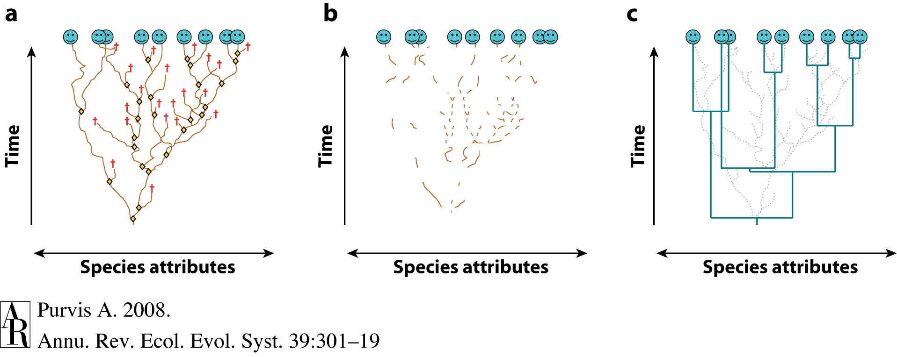
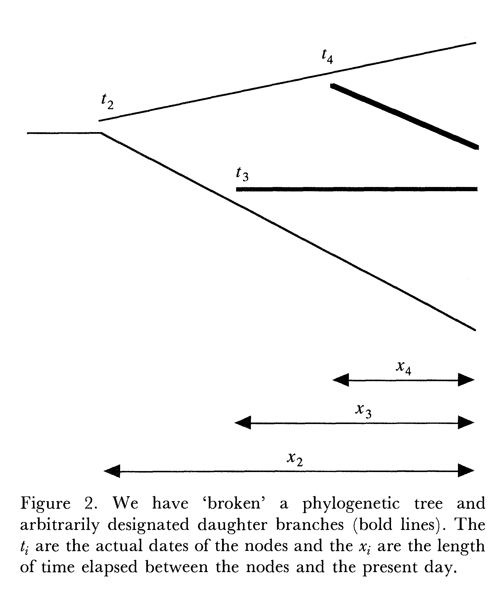
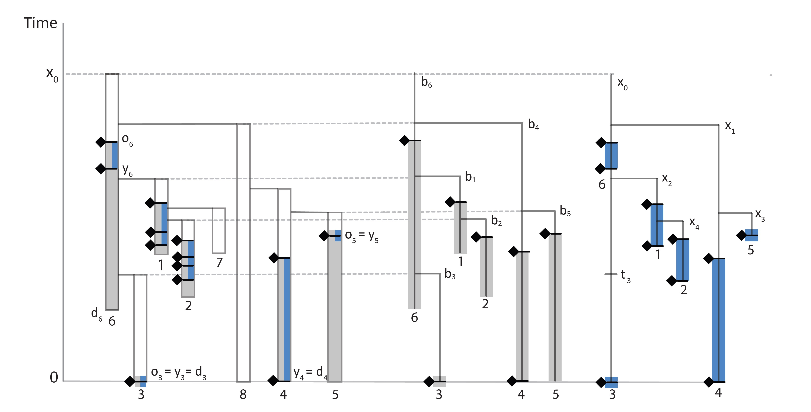

# Tripartite Model 3: Fossilized Birth Death

### David W. Bapst, Laura Soul
#### Lecture & Hands-On with RevBayes/RevNotebook

## Pure Birth Models

Nee 2006

## Birth-Death Models

### How We've Used Birth-Death In Paleontology

something something Foote, per-capita rates

### Birth-Death Models For Phylogenies

/home/dwbapst/workspace/PaleoSoc_phylo_short_course_2019/vignettes/module_07_TripartiteModel3_Fossilized_Birth_death/lineage_ages_in_Nee_etal._1994.jpg

## Fossilized Birth-Death Model

### Serial Sampling

### Sampled Ancestors

### FBD Ranges Model

# Bringing It All Together

## How long will it run?

A long time.

## Post-Analysis Examination

The MCMC is done. That was the easy part, now its the hard part.

### Did it converge?

Tracer

### What did the posterior find?

More Tracer

### Summarizing the tree(s)

> A single tree is not worth the forest.

# NOTES

	- Fossilized Birth Death Models 
		- Stadler, 2010; Heath et al., 2014; Stadler et al., 2018
		- FBD, Range-FBD
	- Anc-Desc Relationships, Sampled Ancestors in Tip-Dating
		- Sampled Ancestor Moves in MCMC
		- Gavryushkina et al. 2014; 2016
	- Try to simplify, do not get lost in covering historical perspective
		- April: Simulate under a pure-birth process and ask whose data looks like this? Simulate under the FBD and show that this process allows sampled ancestors? 	
	- Unifies morph, clocks, tree priors
	- Goes from start to end of an analytical process
	- From Pete:
		- BD & FBD (BDS) models for putting prior probabilities on tree topologies offer independent check on characters (Tripartite Model 3).
		- A. Emphasis: Probabilities getting fossil record given phylogeny based on likelihood of unsampled ancestors AND probability of no sampled sister taxa (aka, Raup’s Revenge).
		- B. Our old friend hyperpriors used to create distributions for these rates.
		- Z. Wow, that’s cool: but I’m now using everything and the kitchen sink; can I do anything with the results?	
