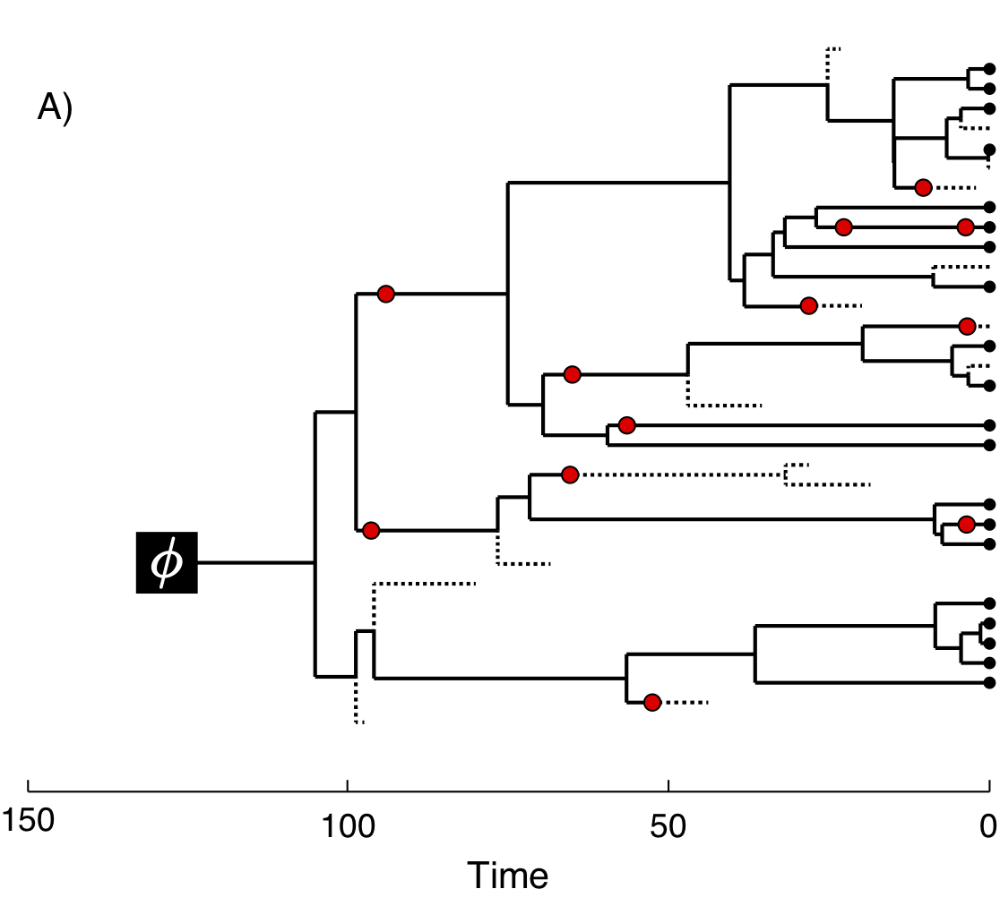

Overview 
========

This tutorial demonstrates how to specify the models used in a Bayesian
“total-evidence” phylogenetic analysis of extant and fossil species,
combining morphological and molecular data as well as stratigraphic
range data from the fossil record [[[*e.g.,*]{}]{}
@Ronquist2012a; @Zhang2016; @Gavryushkina2016]. We begin with a concise
introduction to the models used in this analysis in section
Introduction, followed by a detailed example analysis in
section Exercise demonstrating how to apply these models in
[`RevBayes`]{}[@Hoehna2017a] and use Markov chain Monte Carlo (MCMC) to
estimate the posterior distribution of dated phylogenies for data
collected from living and fossil bears (family Ursidae).

Requirements 
------------

### Required Software 

This tutorial requires that you download and install the latest release
of [`RevBayes`]{}[@Hoehna2017a], which is available for Mac OS X,
Windows, and Linux operating systems. Directions for downloading and
installing the software are available on the program webpage:
[http://revbayes.com](http://revbayes.com/). The exercise provided also
requires additional programs for editing text files and visualizing
output. The following are very useful tools for working with
[`RevBayes`]{}:

-   A good text editor – if you do not already have one that you like,
    we recommend one that has features for syntax coloring, easy
    navigation between different files, line numbers, etc. Good options
    include [Sublime Text](http://www.sublimetext.com/) or
    [Atom](https://atom.io/), which are available for Mac OSX, Windows,
    and Linux.

-   [Tracer](http://tree.bio.ed.ac.uk/software/tracer/) – for
    visualizing and assessing numerical parameter samples from
    [`RevBayes`]{}

-   [IcyTree](http://tgvaughan.github.io/icytree/) – a web-hosted
    phylogenetic tree visualization tool that is supported for
    [Firefox](https://www.mozilla.org/en-US/firefox/products/) or
    [Google Chrome](https://www.google.com/chrome/) browsers

-   [FigTree](http://tree.bio.ed.ac.uk/software/figtree/) – a tree
    visualization program

Introduction 
============

The “total-evidence” analysis described in this tutorial uses a
probabilistic graphical model [@Hoehna2014b] integrating three separate
likelihood components or data partitions (Fig. 1): one
for molecular data one for morphological data, and one for
fossil stratigraphic range data.
In addition, all likelihood components are conditioned on a tree
topology with divergence times, which is modeled according to a separate
prior component.


In figure 2 we provide an example of the type of tree
estimated from a total-evidence analysis. This example shows the
complete tree (Fig. 2A) and the sampled or
reconstructed tree (Fig. 2B). Importantly, we are
interested in estimating the topology, divergence times, and fossil
sample times of the *reconstructed tree* (Fig. 2B).
We will describe the distinction between these two trees in the section Intro to FBD.


Complete Tree            |  Sampled Tree
:-------------------------:|:-------------------------:
  |  


Lineage Diversification and Sampling {#subsect:Intro-FBD}
------------------------------------

The joint prior distribution on tree topologies and divergence times of
living and extinct species used in this tutorial is described by the
*fossilized birth-death* (FBD) process [@Stadler2010; @Heath2014]. This
model simply treats the fossil observations as part of the process
governing the tree topology and branch times (the node in
Fig. 3). The fossilized birth-death process provides a
model for the distribution of speciation times, tree topology, and
lineage samples before the present ([[*e.g.,*]{}]{}non-contemporaneous
samples like fossils or viruses). This type of tree is shown in figure
2. Importantly, this model can be used *with or
without* character data for the historical samples. Thus, it provides a
reasonable prior distribution for analyses combining morphological or
DNA data for both extant and fossil taxa—[[*i.e.,*]{}]{}the so-called
“total-evidence” approaches described by @Ronquist2012a and extended by
@Zhang2016 and @Gavryushkina2016. When matrices of discrete
morphological characters for both living and fossil species are
unavailable, the fossilized birth-death model imposes a time structure
on the tree by
[*marginalizing*](https://en.wikipedia.org/wiki/Marginal_distribution)
over all possible attachment points for the fossils on the extant tree
[@Heath2014], therefore, some prior knowledge of phylogenetic
relationships is important.

The FBD model (Fig. 3) describes the probability of the
tree and fossils conditional on the birth-death parameters:
$f[\mathcal{T} \mid \lambda, \mu, \rho, \psi, \phi]$, where
$\mathcal{T}$ denotes the tree topology, divergence times, fossil
occurrence times, and the times at which the fossils attach to the tree.
The birth-death parameters $\lambda$ and $\mu$ denote the speciation and
extinction rates, respectively. The “fossilization rate” or “fossil
recovery rate” is denoted $\psi$ and describes the rate at which fossils
are sampled along lineages of the complete tree. The sampling
probability parameter $\rho$ represents the *probability* that an extant
species is sampled, and $\phi$ represents the time at which the process
originated.


In the example FBD tree shown in figure 2, the
diversification process originates at time $\phi$, giving rise to $n=20$
species in the present, with both sampled fossils (red circles) and
extant species (black circles). All of the lineages represented in
figure 2A (both solid and dotted lines) show the
*complete tree*. This is the tree of all extant *and* extinct lineages
generated by the process. The complete tree is distinct from the
*reconstructed tree* (Fig. 2B) which is the tree
representing only the lineages sampled as extant taxa or fossils. Fossil
observations (red circles in figure 2) are recovered
over the lifetime of the process along the lineages of the complete
tree. If a lineage does not have any descendants sampled in the present,
it is lost and cannot be observed, these are the dotted lines in figure
2A. The probability must be conditioned on the origin
time of the process $\phi$. The origin ($\phi$) of a birth-death process
is the starting time of the *stem* lineage, thus this conditions on a
single lineage giving rise to the tree.

An important characteristic of the FBD model is that it accounts for the
probability of sampled ancestor-descendant pairs [@foote1996]. Given
that fossils are sampled from lineages in the diversification process,
the probability of sampling fossils that are ancestors to taxa sampled
at a later date is correlated with the turnover rate ($r=\mu/\lambda$)
and the fossil recovery rate ($\psi$). This feature is important,
particularly for datasets with many sampled fossils. In the example
(Fig. 2), several of the fossils have sampled
descendants. These fossils have solid black lines leading to the
present.

Incorporating Fossil Occurrence Time Uncertainty
------------------------------------------------

In order to account for uncertainty in the ages of our fossil species,
we can incorporate intervals on the ages of our represented fossil
species. These intervals can be stratigraphic ranges or measurement
standard error. We do this by assuming each fossil can occur with
uniform probability anywhere within its observed interval. This is
somewhat different from the typical approach to node calibration. Here,
instead of treating the calibration density as an additional prior
distribution on the tree, we treat it as the *likelihood* of our fossil
data given the tree parameter. Specifically, we assume the likelihood of
a particular fossil observation $\mathcal{F}_i$ is equal to one if the
fossil’s inferred age on the tree $t_i$ falls within its observed time
interval $(a_i,b_i)$, and zero otherwise:
$$f[\mathcal{F}_i \mid a_i, b_i, t_i] = \begin{cases}
1 & \text{if } a_i < t_i < b_i\\
0 & \text{otherwise}
\end{cases}$$ In other words, we assume the likelihood is equal to one
if the inferred age is consistent with the data observed. We can
represent this likelihood in [`RevBayes`]{}using a distribution that is
proportional to the likelihood, [[*i.e.,*]{}]{}non-zero when the
likelihood is equal to one (Fig. 4). This model
component represents the observed in the modular graphical model shown
in figure 1.


It is worth noting that this is not technically the appropriate way to
model fossil data that are actually observed as stratigraphic ranges. In
paleontology, a stratigraphic range represents the interval of time
between the first and last appearences of a fossilized species. Thus,
this range typically represents multiple fossil specimens observed at
different times along a single lineage. An extension of the fossilized
birth-death process that is a distribution on stratigraphic ranges has
been described by @Stadler2017. This model is not yet fully implemented
in [`RevBayes`]{}.


Example: Estimating the Phylogeny and Divergence Times of Fossil Cinctans
=================================================================================

In this exercise, we will combine different types of data from 23
fossil species. For the fossil species, occurrence times are obtained from the literature or
fossil databases like the [Fossilworks PaleoDB](http://fossilworks.org/)
or the [Fossil Calibration Database](http://fossilcalibrations.org/), or
from your own paleontological expertise. | 

Tutorial Format 
---------------

This tutorial follows a specific format for issuing instructions and
information.

The boxed instructions guide you to complete tasks that are not part of
the [`RevBayes`]{}syntax, but rather direct you to create directories or
files or similar.

Information describing the commands and instructions will be written in
paragraph-form before or after they are issued.

All command-line text, including all [`Rev`]{}syntax, are given in
[[`monotype font`]{}]{}. Furthermore, blocks of [`Rev`]{}code that are
needed to build the model, specify the analysis, or execute the run are
given in separate shaded boxes. For example, we will instruct you to
create a constant node called [[`rho`]{}]{} that is equal to
[[`1.0`]{}]{} using the [[`<-`]{}]{} operator like this:
```{r eval = FALSE}

    rho <- .506
```
It is important to be aware that some PDF viewers may render some
characters given as differently. Thus, if you copy and paste text from
this PDF, you may introduce some incorrect characters. Because of this,
we recommend that you type the instructions in this tutorial or copy
them from the scripts provided.


Creating [`Rev`]{}Files 
-----------------------

For complex models and analyses, it is best to create [`Rev`]{}script
files that will contain all of the model parameters, moves, and
functions. In this exercise, you will work primarily in your text
editor[^1] and create a set of modular files that will be easily managed
and interchanged. You will write the following files from scratch and
save them in the [[`scripts`]{}]{} directory:

-   [[`mcmc_TEFBD.Rev`]{}]{}: the master [`Rev`]{}file that loads the
    data, the separate model files, and specifies the monitors and MCMC
    sampler.

-   [[`model_FBDP_TEFBD.Rev`]{}]{}: specifies the model parameters and
    moves required for the fossilized birth-death prior on the tree
    topology, divergence times, fossil occurrence times, and
    diversification dynamics.


All of the files that you will create are also provided in the
[`RevBayes`]{}tutorial repository[^2]. Please refer to these files to
verify or troubleshoot your own scripts.

Start the Master [`Rev`]{}File and Import Data 
----------------------------------------------

Open your text editor and create the master [`Rev`]{}file called in the
[[`scripts`]{}]{} directory.

Enter the [`Rev`]{}code provided in this section in the new model file.

The file you will begin in this section will be the one you load into
[`RevBayes`]{}when you’ve completed all of the components of the
analysis. In this section you will begin the file and write the
[`Rev`]{}commands for loading in the taxon list and managing the data
matrices. Then, starting in section  Model FBD, you
will move on to writing module files for each of the model components.
Once the model files are complete, you will return to editing
[[`mcmc_TEFBD.Rev`]{}]{} and complete the [`Rev`]{}script with the
instructions given in section Complete MCMC\].

### Load Taxon List 

Begin the [`Rev`]{}script by loading in the list of taxon names from the
[[`bears_taxa.tsv`]{}]{} file using the [[`readTaxonData()`]{}]{}
function.
```{r eval = FALSE}
    taxa <- readTaxonData("data/cincta_fossil_intervals_FA.tsv")
```

This function reads a tab-delimited file and creates a variable called
[[`taxa`]{}]{} that is a list of all of the taxon names relevant to this
analysis. This list includes all of cinctans.

### Load Data Matrices 

[`RevBayes`]{}uses the function [[`readDiscreteCharacterData()`]{}]{} to
load a data matrix to the workspace from a formatted file. This function
can be used for both discrete morphological
characters.

Next, import the morphological character matrix and assign it to the
variable [[`morpho`]{}]{}.

```{r eval = FALSE}
    morpho <- readDiscreteCharacterData("data/Cinctans_for_RevBayes.nex")
```


### Create Helper Variables 

Before we begin writing the [`Rev`]{}scripts for each of the model
components, we need to instantiate a couple “helper variables” that will
be used by downstream parts of our model specification files. These
variables will be used in more than one of the module files so it’s best
to initialize them in the master file.

Create a new constant node called [[`n_taxa`]{}]{} that is equal to the
number of species in our analysis (22).

```{r eval = FALSE}
    n_taxa <- taxa.size() 
```

Next, create a workspace variable called [[`moves`]{}]{}. This variable is
an iterator that will build a vector containing all of the MCMC moves
used to propose new states for every stochastic node in the model graph.
Each time a new move is added to the vector, [[`moves`]{}]{} will be
incremented by a value of [[`1`]{}]{}.
```{r eval = FALSE}
    moves = VectorMoves()
    monitors = VectorMonitors()
    ```

One important distinction here is that [[`moves`]{}]{} is part of the
[`RevBayes`]{}workspace and not the hierarchical model. Thus, we use the
workspace assignment operator [[`=`]{}]{} instead of the constant node
assignment [[`<-`]{}]{}.

Save your current working version of [[`mcmc_TEFBD.Rev`]{}]{} in the
[[`scripts`]{}]{} directory.

We will now move on to the next [`Rev`]{}file and will complete
[[`mcmc_TEFBD.Rev`]{}]{} in section Complete MCMC.

The Fossilized Birth-Death Process 
----------------------------------

Open your text editor and create the fossilized birth-death model file
called in the [[`scripts`]{}]{} directory.

Enter the [`Rev`]{}code provided in this section in the new model file.

This file will define the models described in sections
Intro to FBD and Intro to TipSampling above. If
necessary, please review the graphical models depicted for the
fossilized birth-death process (Fig. 3) and the likelihood
of the tip sampling process (Fig. 3).

### Speciation and Extinction Rates {#subsub:Exercise-FBD-SpeciationExtinction}

Two key parameters of the FBD process are the speciation rate (the rate
at which lineages are added to the tree, denoted by $\lambda$ in
Fig. 3) and the extinction rate (the rate at which
lineages are removed from the tree, $\mu$ in Fig. 3).
We’ll place exponential priors on both of these values. Each parameter
is assumed to be drawn independently from a different exponential
distribution with rates $\delta_{\lambda}$ and $\delta_{\mu}$
respectively (see Fig. 3). Here, we will assume that
$\delta_{\lambda} = \delta_{\mu} = 10$. Note that an exponential
distribution with $\delta = 10$ has an expected value (mean) of $1/10$.

Create the exponentially distributed stochastic nodes for the
[[`speciation_rate`]{}]{} and [[`extinction_rate`]{}]{} using the
[[`~`]{}]{} operator.
```{r eval = FALSE}

    speciation_rate ~ dnExponential(10)
    extinction_rate ~ dnExponential(10)
```
For every stochastic node we declare, we must also specify proposal
algorithms (called *moves*) to sample the value of the parameter in
proportion to its posterior probability. If a move is not specified for
a stochastic node, then it will not be estimated, but fixed to its
initial value.

The rate parameters for extinction and speciation are both positive,
real numbers ([[*i.e.,*]{}]{}non-negative floating point variables). For
both of these nodes, we will use a scaling move ([[`mvScale()`]{}]{}),
which proposes multiplicative changes to a parameter. Many moves also
require us to set a *tuning value*, called [[`lambda`]{}]{} for
[[`mvScale()`]{}]{}, which determine the size of the proposed change.
Here, we will use three scale moves for each parameter with different
values of lambda. By using multiple moves for a single parameter, we
will improve the mixing of the Markov chain.
```{r eval = FALSE}

    moves.append(mvScale(speciation_rate, lambda=0.01, weight=1))
    moves.append(mvScale(speciation_rate, lambda=0.1,  weight=1))
    moves.append(mvScale(speciation_rate, lambda=1.0,  weight=1))

    moves.append(mvScale(extinction_rate, lambda=0.01, weight=1))
    moves.append(mvScale(extinction_rate, lambda=0.1,  weight=1))
    moves.append(mvScale(extinction_rate, lambda=1,    weight=1))
```

You will also notice that each move has a specified [[`weight`]{}]{}.
This option allows you to indicate how many times you would like a given
move to be performed at each MCMC cycle. The way that we will run our
MCMC for this tutorial will be to execute a *schedule* of moves at each
step in our chain instead of just one move per step, as is done in
[MrBayes]{} [@Ronquist2003] or [BEAST]{}
[@Drummond2012; @Bouckaert2014]. Here, if we were to run our MCMC with
our current vector of 6 moves, then our move schedule would perform 6
moves at each cycle. Within a cycle, an individual move is chosen from
the move list in proportion to its weight. Therefore, with all six moves
assigned [[`weight=1`]{}]{}, each has an equal probability of being
executed and will be performed on average one time per MCMC cycle. For
more information on moves and how they are performed in [`RevBayes`]{},
please refer to the [[***Introduction to
MCMC***]{}](https://github.com/revbayes/revbayes_tutorial/blob/master/tutorial_TeX/RB_MCMC_Binomial_Tutorial/RB_MCMC_Binomial_Tutorial.pdf)
and [[***Substitution
Models***]{}](https://github.com/ssb2017/revbayes_intro/blob/master/tutorials/RB_CTMC_Tutorial.pdf)
tutorials.

In addition to the speciation ($\lambda$) and extinction ($\mu$) rates,
we may also be interested in inferring diversification ($\lambda - \mu$)
and turnover ($\mu/\lambda$). Since these parameters can be expressed as
a deterministic transformation of the speciation and extinction rates,
we can monitor (that is, track the values of these parameters, and print
them to a file) their values by creating two deterministic nodes using
the [[`:=`]{}]{} operator.
```{r eval = FALSE}

    diversification := speciation_rate - extinction_rate
    turnover := extinction_rate/speciation_rate
```
### The Fossil Sampling Rate 

Since our data set includes serially sampled lineages, we must also
account for the rate of sampling back in time. This is the fossil
sampling (or recovery) rate ($\psi$ in Fig. 3), which we
will instantiate as a stochastic node (named [[`psi`]{}]{}). As with the
speciation and extinction rates
(Sect. FBD-Speciation & Extinction\]), we will use an
exponential prior on this parameter and use scale moves to sample values
from the posterior distribution.
```{r eval = FALSE}

    psi ~ dnExponential(10) 
    moves.append(mvScale(psi, lambda=0.01, weight=1))
    moves.append(mvScale(psi, lambda=0.1,  weight=1))
    moves.append(mvScale(psi, lambda=1,    weight=1))
```


We also need to specify sampling at the last time interval where we had Cinctans. We have about 50\% of the known Cinctans in this matrix.

```{r eval = FALSE}

    rho <- .506 
```
### The Origin Time {#subsub:Exercise-FBD-Origin}

We will condition the FBD process on the origin time ($\phi$ in
Fig. 3) of bears, and we will specify a uniform
distribution on the origin age. For this parameter, we will use a
sliding window move ([[`mvSlide`]{}]{}). A sliding window samples a
parameter uniformly within an interval (defined by the half-width
[[`delta`]{}]{}). Sliding window moves can be tricky for small values,
as the window may overlap zero. However, for parameters such as the
origin age, there is little risk of this being an issue.
```{r eval = FALSE}

    origin_time ~ dnUnif(10.2, 15.2);
    moves.append(mvSlide(origin_time, delta=0.01, weight=5.0))
    moves.append(mvSlide(origin_time, delta=0.1,  weight=5.0))
    moves.append(mvSlide(origin_time, delta=1,    weight=5.0))
```
Note that we specified a higher move [[`weight`]{}]{} for each of the
proposals operating on [[`origin_time`]{}]{} than we did for the three
previous stochastic nodes. This means that our move schedule will
propose five times as many updates to [[`origin_time`]{}]{} than it will
to [[`speciation_rate`]{}]{}, [[`extinction_rate`]{}]{}, or
[[`psi`]{}]{}.

### The FBD Distribution Object {#subsub:Exercise-FBD-dnFBD}

All the parameters of the FBD process have now been specified. The next
step is to use these parameters to define the FBD tree prior
distribution, which we will call [[`fbd_dist`]{}]{}.
```{r eval = FALSE}

    fbd_dist = dnFBDP(origin=origin_time, lambda=speciation_rate, mu=extinction_rate, psi=psi, rho=rho, taxa=taxa)
```

Then we can specify the final tree prior distribution by
creating a vector of constraints, and providing it along with the
workspace FBD distribution to the constrained topology distribution.
Here we use the stochastic assignment operator `~` to create a
stochastic node for our constrained, FBD-tree variable (called
[[`fbd_tree`]{}]{}).

```{r eval = FALSE}
    fbd_tree ~ dnConstrainedTopology(fbd_dist)
```


### Moves on the Tree Topology and Node Ages {#subsub:Exercise-FBD-TreeMoves}

Next, in order to sample from the posterior distribution of trees, we
need to specify moves that propose changes to the topology
([[`mvFNPR`]{}]{}) and node times ([[`mvNodeTimeSlideUniform`]{}]{}).
Included with these moves is a proposal that will collapse or expand a
fossil branch ([[`mvCollapseExpandFossilBranch`]{}]{}). This will change
a fossil that is a sampled ancestor (see Fig. 2 and
Sect. Intro to FBD) so that it is on its own branch and vice
versa. In addition, when conditioning on the origin time, we also need
to explicitly sample the root age ([[`mvRootTimeSlideUniform`]{}]{}).
```{r eval = FALSE}

    moves.append(mvFNPR(fbd_tree, weight=15.0))
    moves.append(mvCollapseExpandFossilBranch(fbd_tree, origin_time, weight=6.0))
    moves.append(mvNodeTimeSlideUniform(fbd_tree, weight=40.0))
    moves.append(mvRootTimeSlideUniform(fbd_tree, origin_time, weight=5.0))
```
### Sampling Fossil Occurrence Ages {#subsub:Exercise-FBD-TipSampling}

Next, we need to account for uncertainty in the age estimates of our
fossils using the observed minimum and maximum stratigraphic ages
provided in the file [[`bears_fossil_intervals.tsv`]{}]{}. First, we
read this file into a matrix called [[`intervals`]{}]{}.
```{r eval = FALSE}

    intervals = readDataDelimitedFile(file="data/cincta_fossil_intervals_FA.tsv", header=true)
```
Next, we loop over this matrix. For each fossil observation, we create a
uniform random variable representing the likelihood. Remember, we can
represent the fossil likelihood using any uniform distribution that is
non-zero when the likelihood is equal to one
(Sect. Tip Sampling).

For example, if $t_i$ is the inferred fossil age and $(a_i,b_i)$ is the
observed stratigraphic interval, we know the likelihood is equal to one
when $a_i < t_i < b_i$, or equivalently $t_i - b_i < 0 < t_i - a_i$. So
let’s represent the likelihood using a uniform random variable uniformly
distributed in $(t_i - b_i, t_i - a_i)$ and clamped at zero.
```{r eval = FALSE}

# Setup the fossil tip sampling #
# Use a for loop to create a uniform distribution on the occurence time for each fossil #
# The boundaries of the uniform distribution are specified in the tsv file #
for(i in 1:intervals.size())
{
    taxon  = intervals[i][1]
    a_i = intervals[i][2]
    b_i = intervals[i][3]
    t[i] := tmrca(fbd_tree, clade(taxon))

    fossil[i] <- a_i
#    fossil[i] ~ dnSoftBoundUniformNormal(t[i] - b_i, t[i] - a_i, sd = 2, p = 0.025)
#    fossil[i].clamp(0)
}
```
Finally, we add a move that samples the ages of the fossil nodes on the
tree.
```{r eval = FALSE}

    moves.append(mvFossilTimeSlideUniform(fbd_tree, origin_time, weight=5.0))
```
### Monitoring Parameters of Interest using Deterministic Nodes {#subsub:Exercise-FBD-DetNodes}

There are additional parameters that may be of particular interest to us
that are not directly inferred as part of this graphical model. As with
the diversification and turnover nodes specified in section
FBD-Speciation & Extinction, we can create
deterministic nodes to sample the posterior distributions of these
parameters. Create a deterministic node called [[`num_samp_anc`]{}]{}
that will compute the number of sampled ancestors in our
[[`fbd_tree`]{}]{}.
```{r eval = FALSE}
    num_samp_anc := fbd_tree.numSampledAncestors()
```


Complete Master [`Rev`]{}File {#subsect:Exercise-CompleteMCMC}
-----------------------------

Return to the master [`Rev`]{}file you created in section
Start Master Rev called in the [[`scripts`]{}]{}
directory.

Enter the [`Rev`]{}code provided in this section in this file.

### Source Model Scripts {#subsub:Exercise-SourceMods}

[`RevBayes`]{}uses the [[`source()`]{}]{} function to load commands from
[`Rev`]{}files into the workspace. Use this function to load in the
model scripts we have written in the text editor and saved in the
[[`scripts`]{}]{} directory.
```{r eval = FALSE}

    source("Clock_models_for_character_data.Rev")

```
### Create Model Object {#subsub:Exercise-ModObj}

We can now create our workspace model variable with our fully specified
model DAG. We will do this with the [[`model()`]{}]{} function and
provide a single node in the graph ([[`sf`]{}]{}).
```{r eval = FALSE}

    mymodel = model(fbd_tree)
``` 
The object [[`mymodel`]{}]{} is a wrapper around the entire model graph
and allows us to pass the model to various functions that are specific
to our MCMC analysis.

### Specify Monitors and Output Filenames {#subsub:Exercise-Monitors}

The next important step for our master [`Rev`]{}file is to specify the
monitors and output file names. For this, we create a vector called
[[`monitors`]{}]{} that will each sample and record or output our MCMC.


The first monitor we will create will monitor every named random
variable in our model graph. This will include every stochastic and
deterministic node using the [[`mnModel`]{}]{} monitor. The only
parameter that is not included in the [[`mnModel`]{}]{} is the tree
topology. Therefore, the parameters in the file written by this monitor
are all numerical parameters written to a tab-separated text file that
can be opened by accessory programs for evaluating such parameters. We
will also name the output file for this monitor and indicate that we
wish to sample our MCMC every 10 cycles.

```{r eval = FALSE}

    monitors.append(mnModel(filename="output/cinc_dated.log", printgen=10))
```
The [[`mnFile`]{}]{} monitor writes any parameter we specify to file.
Thus, if we only cared about the speciation rate and nothing else (this
is not a typical or recommended attitude for an analysis this complex)
we wouldn’t use the [[`mnModel`]{}]{} monitor above and just use the
[[`mnFile`]{}]{} monitor to write a smaller and simpler output file.
Since the tree topology is not included in the [[`mnModel`]{}]{} monitor
(because it is not numerical), we will use [[`mnFile`]{}]{} to write the
tree to file by specifying our [[`pruned_tree`]{}]{} variable in the
arguments. Remember, we are monitoring the tree with nuisance taxa
pruned out (section FBD Deterministic Nodes).
```{r eval = FALSE}

    monitors.append(mnFile(filename="output/cinc_dated.trees", printgen=10, pruned_tree))
```
The last monitor we will add to our analysis will print information to
the screen. Like with [[`mnFile`]{}]{} we must tell [[`mnScreen`]{}]{}
which parameters we’d like to see updated on the screen. We will choose
the age of the MCRCA of living bears ([[`age_extant`]{}]{}), the number
of sampled ancestors ([[`num_samp_anc`]{}]{}), and the origin time
([[`origin_time`]{}]{}).
```{r eval = FALSE}

    monitors.append(mnScreen(printgen=10, num_samp_anc, origin_time))
```
### Set-Up the MCMC

Once we have set up our model, moves, and monitors, we can now create
the workspace variable that defines our MCMC run. We do this using the
[[`mcmc()`]{}]{} function that simply takes the three main analysis
components as arguments.
```{r eval = FALSE}

    mymcmc = mcmc(mymodel, monitors, moves)
```
The MCMC object that we named [[`mymcmc`]{}]{} has a member method
called [[`.run()`]{}]{}. This will execute our analysis and we will set
the chain length to [[`10000`]{}]{} cycles using the
[[`generations`]{}]{} option.
```{r eval = FALSE}

    mymcmc.run(generations=10000)
```
Once our Markov chain has terminated, we will want [`RevBayes`]{}to
close. Tell the program to quit using the [[`q()`]{}]{} function.
```{r eval = FALSE}

    q()
```
You made it! Save all of your files.

Execute the MCMC Analysis 
-------------------------

With all the parameters specified and all analysis components in place,
you are now ready to run your analysis. The [`Rev`]{}scripts you just
created will all be used by [`RevBayes`]{}and loaded in the appropriate
order.

Begin by running the [`RevBayes`]{}executable. In Unix systems, type the
following in your terminal (if the [`RevBayes`]{}binary is in your
path):

Provided that you started [`RevBayes`]{}from the correct directory
([[`RB_TotalEvidenceDating_FBD_Tutorial`]{}]{}), you can then use the
[[`source()`]{}]{} function to feed [`RevBayes`]{}your master script
file ([[`mcmc_TEFBD.Rev`]{}]{}).

    source("scripts/mcmc_TEFBD.Rev")

This will execute the analysis and you should see the following output
(though not the exact same values):

When the analysis is complete, [`RevBayes`]{}will quit and you will have
a new directory called [[`output`]{}]{} that will contain all of the
files you specified with the monitors
(Sect. Exercise Monitors).

Evaluate and Summarize Your Results 
-----------------------------------

### Evaluate MCMC 

In this section, we will evaluate the *mixing* and *convergence* of our
MCMC simulation using the program [Tracer]{}. We can also summarize the
marginal distributions for particular parameters we’re interested in.
[Tracer](http://tree.bio.ed.ac.uk/software/tracer/) [@Rambaut2011] is a
tool for visualizing parameters sampled by MCMC. This program is limited
to numerical parameters, however, and cannot be used to summarize or
analyze MCMC samples of the tree topology (this will be discussed
further in section Summarize Trees).


Open [Tracer]{} and import the [[`bears.log`]{}]{} file in the
[***FileImport New Trace File***]{}. Or click the button on the
left-hand side of the screen to add your log file.


Immediately upon loading your file,
you will see the list of [***Trace Files***]{} on the left-hand side
(you can load multiple files). The bottom left section, called
[***Traces***]{}, provides a list of every parameter in the log file,
along with the mean and the effective sample size (ESS) for the
posterior sample of that parameter. The ESS statistic provides a measure
of the number of independent draws in our sample for a given parameter.
This quantity will typically be much smaller than the number of
generations of the chain. In [Tracer]{}, poor to fair values for the ESS
will be colored red and yellow. You will likely see a lot of red and
yellow numbers because the MCMC runs in this exercise are too short to
effectively sample the posterior distributions of most parameters. A
much longer analysis is provided in the [[`output`]{}]{} directory.

The inspection window for your selected parameter is the
[***Estimates***]{} window, which shows a histogram and summary
statistics of the values sampled by the Markov chain. Figure
6 shows the marginal distribution of the
[***Posterior***]{} statistic for the [[`bears.log`]{}]{} file in the
[[`output`]{}]{} directory.

Look through the various parameters and statistics in the list of
[***Traces***]{}.

[[[ ]{}]{}]{}Are there any parameters that have really low ESS? Why do
you think that might be?

Next, we can click over to the [***Trace***]{} window. This window shows
us the samples for a given parameter at each iteration of the MCMC. The
left side of the chain has a shaded portion that has been excluded as
“burn-in”. Samples taken near the beginning of chain are often discarded
or “burned” because the MCMC may not immediately begin sampling from the
target posterior distribution, particularly if the starting condition of
the chain is far from the region of highest posterior density. Figure
7 shows the trace for the extinction rate.


The [***Trace***]{} window allows us to evaluate how well our chain is
sampling the target distribution. For a fairly short analysis, the
output in figure \[fig:tracer-extinction-trace\] shows reasonable
*mixing*—there is no consistent pattern or trend in the samples, nor are
there long intervals where the statistic does not change. The presence
of a trend or large leaps in a parameter value might indicate that your
MCMC is not mixing well. You can read more about MCMC tuning and
improving mixing in the tutorials [[***Intro to
MCMC***]{}](https://github.com/revbayes/revbayes_tutorial/raw/master/tutorial_TeX/RB_MCMC_Binomial_Tutorial/RB_MCMC_Binomial_Tutorial.pdf)
and [[***MCMC
Algorithms***]{}](https://github.com/revbayes/revbayes_tutorial/raw/master/tutorial_TeX/RB_MCMC_Tutorial/RB_MCMC_Tutorial.pdf).

Look through the traces for your parameters.

[[[ ]{}]{}]{}Are there any parameters in your log files that show trends
or large leaps? What steps might you take to solve these issues?

In [Tracer]{} you can view the marginal probability distributions of
your parameters in the [***Marginal Prob Distribution***]{} window.
Using this tool, you can compare the distributions of several different
parameters (by selecting them both).

Go to the [[`diversification`]{}]{} parameter in the [***Marginal Prob
Distribution***]{} window.

[[[ ]{}]{}]{}What is the mean value estimated for the net
diversification rate ($d$)? What does the marginal distribution tell you
about the net diversification? (Hint: $d = \lambda - \mu$)

While specifying the model, remember that we created several
deterministic nodes that represent parameters that we would like to
estimate, including the net diversification rate. [Tracer]{} allows us
to view the summaries of these parameters since they appear in our log
files.

Go to the [[`age_extant`]{}]{} parameter in the [***Estimates***]{}
window.

[[[ ]{}]{}]{}What is the mean and 95% highest posterior density of the
age of the MRCA for all living bears?

Since you have evaluated several of the parameters by viewing the trace
files and the ESS values, you may be aware that the MCMC analysis you
conducted for this tutorial did not sufficiently sample the joint
posterior distribution of phylogenetic parameters. More explicitly,
*your run has not converged*. It is not advisable to base your
conclusions on such a run and it will be critical to perform multiple,
independent runs for many more MCMC cycles. For further discussion of
recommended MCMC practices in [`RevBayes`]{}, please see the [[***Intro
to
MCMC***]{}](https://github.com/revbayes/revbayes_tutorial/raw/master/tutorial_TeX/RB_MCMC_Binomial_Tutorial/RB_MCMC_Binomial_Tutorial.pdf)
and [[***MCMC
Algorithms***]{}](https://github.com/revbayes/revbayes_tutorial/raw/master/tutorial_TeX/RB_MCMC_Tutorial/RB_MCMC_Tutorial.pdf)
tutorials.

### Summarize Tree 

In addition to evaluating the performance and sampling of an MCMC run
using numerical parameters, it is also important to inspect the sampled
topology and tree parameters. This is a difficult endeavor, however. One
tool for evaluating convergence and mixing of the tree samples is
[RWTY](https://github.com/danlwarren/RWTY) [@Warren2016]. In this
tutorial, we will only summarize the sampled trees, but we encourage you
to consider approaches for assessing the performance of the MCMC with
respect to the tree topology.

Ultimately, we are interested in summarizing the sampled trees and
branch times, given that our MCMC has sampled all of the important
parameters in proportion to their posterior probabilities.
[`RevBayes`]{}includes some functions for summarizing the tree topology
and other tree parameters.

We will complete this part of the tutorial using
[`RevBayes`]{}interactively. Begin by running the
[`RevBayes`]{}executable. You should do this from within the
[[`RB_TotalEvidenceDating_FBD_Tutorial`]{}]{} directory.

In Unix systems, type the following in your terminal (if the
[`RevBayes`]{}binary is in your path):

Read in the MCMC sample of trees from file.

    trace = readTreeTrace("output/bears.trees")

By default, a burn-in of 25% is used when creating the tree trace (250
trees in our case). You can specify a different burn-in fraction, say
50%, by typing the command .

Now we will use the [[`mccTree()`]{}]{} function to return a maximum
clade credibility (MCC) tree. The MCC tree is the tree with the maximum
product of the posterior clade probabilities. When considering trees
with sampled ancestors, we refer to the maximum sampled ancestor clade
credibility (MSACC) tree [@Gavryushkina2016].

    mccTree(trace, file="output/bears.mcc.tre" )

When there are sampled ancestors present in the tree, visualizing the
tree can be fairly difficult in traditional tree viewers. We will make
use of a browser-based tree viewer called
[IcyTree](http://tgvaughan.github.io/icytree/), created by [Tim
Vaughan](https://github.com/tgvaughan). [IcyTree]{} has many unique
options for visualizing phylogenetic trees and can produce
publication-quality vector image files ([[*i.e.,*]{}]{}SVG).
Additionally, it correctly represents sampled ancestors on the tree as
nodes, each with only one descendant (Fig. 8).


Navigate to <http://tgvaughan.github.io/icytree> and open the file
[[`output/bears.mcc.tre`]{}]{} in [IcyTree]{}.

[[[ ]{}]{}]{}Try to replicate the tree in Fig. 8.
(Hint: [***StyleMark Singletons***]{}) Why might a node with a sampled
ancestor be referred to as a singleton?

[[[ ]{}]{}]{}How can you see the names of the fossils that are putative
sampled ancestors?

[[[ ]{}]{}]{}Try mousing over different branches (see
Fig. 9). What are the fields telling you? [[[
]{}]{}]{}What is the posterior probability that *Zaragocyon daamsi* is a
sampled ancestor?

Another newly available web-based tree viewer is
[Phylogeny.IO](http://phylogeny.io/) [@Jovanovic2016]. Try this site for
a different way to view the tree.


## References