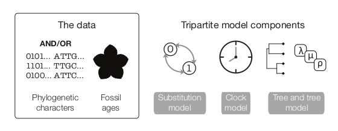
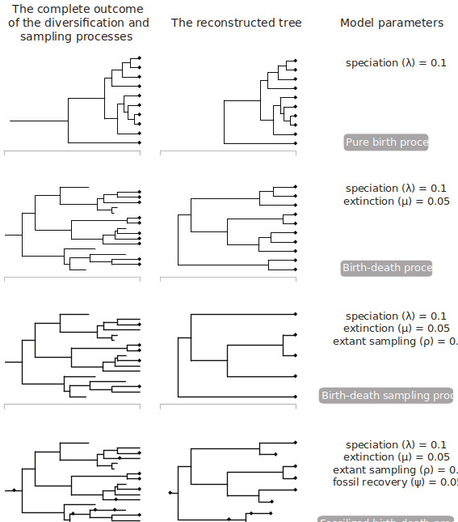
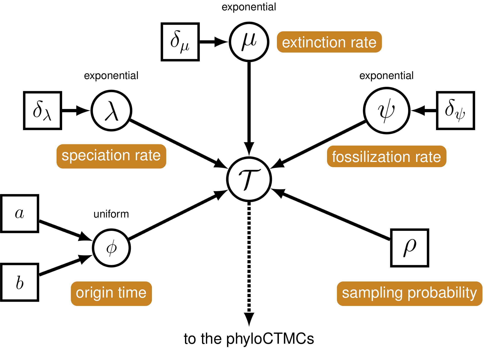

This tutorial builds upon the previous three tutorials to estimate a dated phylogeny from discrete morphological data using the Fossilized Birth-Death Model (FBD) [@stadler2010; @heath2014]. Broadly, the FBD model is a "total-evidence" model and can incorporate fossil ages, molecular data, and morphological data to estimate a tree with branch lengths in units of absolute time.
In this tutorial, we will focus on fossil ages and morphological data to estimate our phylogeny. Using an example from a 2013 by Zamora et al., we will estimate a total evidence phylogeny of the Cinctans.


# Introduction 


*Figure One: A representation of the data required for and model subcomponents of the Fossilized Birth-Death model*

The above figure (Warnock and Wright 2020) demonstrates the "total-evidence" framework of the FBD model. In this model, there are three submodels. One describes cahracter change (the substitution model), one describes how rates of evolution are distributed across the tree (the clock model), and the final component describes how speciation, extinction and fossil sampling events are distributed in time (the tree model). The substitution and clock models have been discussed in the previous two tutorials.


Below is an image from Warnock and Wright (2020) showing the true tree and the reconstructed tree.  The reconstructed tree is the tree we are capable of inferring from our fossil phylogenetic characters and our fossil ages. The true tree, on the other hand, is unkowable, as we will never have complete sampling in the past and the present.


*Figure Two: Different sets of FBD parameters can give rise to different reconstructed trees*


## Tree model

In this tutorial, we will explain a prior on topologies, divergence times, and macroevolutionary parameters called the *fossilized birth-death* (FBD) process [@Stadler2010; @Heath2014]. This manner of divergence time estimation is different than other approaches. For example, you may be familiar with *node calibration* approaches, in which the age of a fossil is used to constrain the age of a node. While these approaches have historically been well-used, the FBD makes more complete use of the fossil record. This is because the FBD, as shown on figure 1, is a hierarchical prior. This allows us to model the evolution of morphological characters to place specimens on the tree. Rather than using only the age information, and telling the method where the fossil goes, the placement of the fossil can be estimated in the analysis. Taxa without phylogenetic characters can still be used in this analysis. While they cannot be placed using a character model, the FBD model marginalizes over possible placements for a taxon, which allows for the age information to still be used.

The FBD model is a macroevolutionary model describing the process of speciation ( the addition of lineages to the tree - $ \lambda $), extinction (the removal of lineages from a population - $ \mu $), fossil sampling (recovery of lineages in the past - $ \psi $) and extant sampling (recovery of contemporaneous lineages - $ \rho $). Origin time ($ \phi $) describes the time at which the process of diversification and sampling began in your lineage. 



*Figure Three: A graphical model showing the FBD from a [tutorial](https://revbayes.github.io/tutorials/fbd/) by Heath, Wright and Pett can be seen below.*

As shown in Fig. 2, different combinations of these parameters can lead to different shapes of the reconstructed tree. In all of these simulations, the lineage begins with one lineage at 40 million years ago. As can be seen on the figure, different sets of parameters can lead to more samples in the past, or fewer. Parameters such as extinction and speciation can lead to different number of nodes on the tree. And fossil sampling generates the possibility that some sampled fossils actually lie as 2-degree nodes. That is, they did not go extinct when sampled, and have descendents on the phylogeny.

Example: Estimating the Phylogeny and Divergence Times of Fossil Cinctans
=================================================================================

In this exercise, we will combine different types of data from 23
fossil species. For the fossil species, occurrence times are obtained from the literature or
fossil databases like the [Fossilworks PaleoDB](http://fossilworks.org/)
or the [Fossil Calibration Database](http://fossilcalibrations.org/), or
from your own paleontological expertise. | 

### Load Taxon List 

First, we will load in a list of all the taxa that will be in our analysis. This includes taxa for which we have morphological data, and taxa for which we only have ages. We will load the `cinctans_taxa.tsv` file using the `readTaxonData()`
function.

```{rb, freshHistoryRB=TRUE}
    taxa <- readTaxonData("data/cincta_fossil_intervals_FA.tsv")
```

This function reads a tab-delimited file and creates a variable called
`taxa` that is a list of all of the taxon names relevant to this
analysis. This list includes all of cinctans we are adding to the tree. Because fossils are data under the FBD model, even in the absence of phylogenetic characters, they are included in the file.

### Load Data Matrices 

`RevBayes` uses the function `readDiscreteCharacterData()` to
load a data matrix to the workspace from a Nexus formatted file. This function
can be used for both discrete morphological characters and molecular characters, if you have them.

Import the morphological character matrix and assign it to the variable `morpho`.

```{rb}
    morpho <- readDiscreteCharacterData("data/Cinctans.nex")
```


### Create Helper Variables 

Before we begin writing the `Rev` scripts for each of the model components, we need to instantiate a couple “helper variables” that will be used by downstream parts of running and using our models. These variables will be used in multiple places in the analysis, and so we will instantiate them before going any further.

Create a new constant node called `n_taxa` that is equal to the number of species in our analysis (22).

```{rb}
    n_taxa <- taxa.size() 
    num_branches <- 2 * n_taxa - 2
```

Next, create a workspace variable called `moves`. This variable is an iterator that will build a vector containing all of the MCMC moves used to propose new states for every stochastic node in the model graph. Each time we add a parameter to the model, and put a prior on it, this will be incremented by `1`.

```{rb}
    moves = VectorMoves()
    monitors = VectorMonitors()
```

Moves and monitors are part of the RevBayes workspace. They are not parameters of the model. They specify how values for parameters will be sampled. Because they are in the workspace, they are specified with the `=` operator, rather than the assignment operator `<-`. 


The Fossilized Birth-Death Process 
----------------------------------

### Speciation and Extinction Rates 

We will begin by specifying the speciation and extinction rates. These parameters govern the rate at which lineages are added to and removed from the population. From a previous study we know that an expoential distribution with a parameter of 1.471 is a reasonable distribution in which this value could lie. 
```{rb}
  speciation_rate ~ dnExponential(1.471)

  moves.append(mvScale(speciation_rate, lambda=0.01, weight=5));
  moves.append(mvScale(speciation_rate, lambda=0.10, weight=3));
  moves.append(mvScale(speciation_rate, lambda=1.00, weight=1));
```

It is possible to set extinction as its own parameter, for example, like so:

```{rb, eval=FALSE}
  extinction_rate ~ dnExponential(10)
```

However, extinction and speciation rates are often correlated. And so we will instantiate a parameter called turnover, which is the ratio of extinction rate to speciation rate ($ \mu $ / $ \lambda $). The parameters to this lognormal distribution were arrived at by simulation of parameter values from the data.

```{rb}
	turnover ~ dnLognormal(0.945, 1.926745);
	moves.append(mvSlide(turnover, delta=0.01, weight=5))
	moves.append(mvSlide(turnover, delta=0.10, weight=3))
	moves.append(mvSlide(turnover, delta=1.00, weight=1))
```

As discussed in previous lessons, moves specify how often (*weight*), we will sample new values for the parameters in our model. The *delta* of the slide move specifies how different from the initial value a propsed new parameter will be. More information on moves can be found in the [MCMC tutorial](https://revbayes.github.io/tutorials/mcmc/binomial.html). 

Once our turnover is defined, we can also monitor our extinction values like so:
```{rb}
	extinction_rate := turnover*speciation_rate
	diversification := speciation_rate - extinction_rate
```

Next, we will define the sampling in the present. Cinctans are extinct. We will rescale  our times such that the last appearance of Cinctans in the fossil record is the 'present'. Previous studies indicate that about half of Cinctans that existed them are in this analysis [@zamora2013]. We will treat $ \rho $ as a known quantity, a constant node. We will therefore, not specify any moves on this parameter.

```{rb}
    rho <- .506
```

Our data is made up of fossils. We also need to define the rate at which fossils are recovered on the tree. This is the fossil
sampling rate ($\psi$ in Fig. 3). This is also referred to in the literature as the `recovery` rate. Prior research indicates that an exponential distribution with parameter 3.892 should be adequate. 
```{rb}
    psi ~ dnExponential(3.892) 
    moves.append(mvScale(psi, lambda=0.01, weight=1))
    moves.append(mvScale(psi, lambda=0.1,  weight=1))
    moves.append(mvScale(psi, lambda=1,    weight=1))
```

If you do not have a good intution for what this distribution looks like, you can visualize it below.

```{r}
library(ggplot2)

draws <- rexp(1000, 3.891)
hist(draws)
```

### The Origin Time

Finally, we need to define an origin time for the Cinctan group. Because we are rescaling the analysis to the treat the 'present' as last observation of Cinctans, our origin time will be drawn from a uniform distribution between 10.2 and 15.2 mya. In actuality, this corresponds to 508 to 513 million years ago.  
```{rb}

    origin_time ~ dnUnif(10.2, 15.2);
    moves.append(mvSlide(origin_time, delta=0.01, weight=5.0))
    moves.append(mvSlide(origin_time, delta=0.1,  weight=5.0))
    moves.append(mvSlide(origin_time, delta=1,    weight=5.0))
```


### The FBD Distribution Object 

All the parameters of the FBD process have now been specified. The next step is to use these parameters to define the FBD tree prior distribution, which we will call `fbd_dist`. We will use this distribution to simulate a starting tree.
```{rb}

    fbd_dist = dnFBDP(origin=origin_time, lambda=speciation_rate, mu=extinction_rate, psi=psi, rho=rho, taxa=taxa)
```

There has been a good amount of prior work on Cinctans, and we are able to define the ingroup for the Cinctans. For our taxa without phylogenetic characters, this allows us to tell the model that those taxa belong inside the ingroup. The model can then marginalize over their exact placement, and use the age information to date the total ingroup.

```{rb}

ingroup = clade("Ctenocystis_utahensis","Gyrocystis_platessa","Gyrocystis_testudiformis","Gyrocystis_cruzae","Gyrocystis_badulesiensis", "Gyrocystis_erecta","Progyrocystis_disjuncta","Protocinctus_mansillaensis","Elliptocinctus_barrandei","Elliptocinctus_vizcainoi","Sucocystis_theronensis","Sucocystis_bretoni","Lignanicystis_barriosensis","Undatacinctus_undata","Sucocystis_acrofera","Undatacinctus_quadricornuta","Undatacinctus_melendezi","Sotocinctus_ubaghsi","Ludwigicinctus_truncatus","Graciacystis_ambigua","Nelegerocystis_ivantzovi","Rozanovicystis_triangularis","Davidocinctus_pembrokensis")
constraints = v(ingroup)
```

Next, we will draw a starting tree out of this distribution. This will be a tree that is feasible given our model parameters, and consistent with our clade constraints.

```{rb}
    fbd_tree ~ dnConstrainedTopology(fbd_dist, constraints=constraints)
```


### Moves on the Tree Topology and Node Ages 

Fossils require some special moves we have not yet seen in any of the tutorials. Firstly, there is `mvFNPR`, which makes changes to the tree with the knowledge that some tips may not be contemporaneous. `mvCollapseExpandFossilBranch` allows fossils to transiton between being sampled ancestors and tips. The `TimeSlide` moves allow us to sample values for node and origin ages.
```{rb}
    moves.append(mvFNPR(fbd_tree, weight=15.0))
    moves.append(mvCollapseExpandFossilBranch(fbd_tree, origin_time, weight=6.0))
    moves.append(mvNodeTimeSlideUniform(fbd_tree, weight=40.0))
    moves.append(mvRootTimeSlideUniform(fbd_tree, origin_time, weight=5.0))
```
### Sampling Fossil Occurrence Ages 

Next, we need to account for uncertainty in the age estimates of our
fossils using the observed minimum and maximum stratigraphic ages
provided in the file `cinctans_fossil_intervals.tsv`. These values are were obtained and cleaned from the Paleobiology Database. First, we read this file into a matrix called `intervals`.
```{rb}
    intervals = readDataDelimitedFile(file="data/cincta_fossil_intervals_FA.tsv", header=true)
```
Next, we loop over this matrix. For each fossil observation, we create a
uniform random variable representing the likelihood. In this equation $t_i$ is the fossil age. $a_i$ and $b_i$ are the minimum and maximum edges of the fossil age range. And so, we treat the fossil age as being drawn from a uniform distribution between $(t_i - b_i)$ and $(t_i - a_i)$

```{rb}

  intervals = readDataDelimitedFile(file="data/cincta_fossil_intervals_FA.tsv", header=true)
  for(i in 1:intervals.size())
  {
      taxon  = intervals[i][1]
      a_i = intervals[i][2]
      b_i = intervals[i][3]
      t[i] := tmrca(fbd_tree, clade(taxon))
  
      fossil[i] <- a_i
      fossil[i] ~ dnSoftBoundUniformNormal(t[i] - b_i, t[i] - a_i, sd = 2, p = 0.025)
  }
```


Finally, we add a move that samples the ages of the fossil nodes on the tree.
```{rb}
  moves.append(mvFossilTimeSlideUniform(fbd_tree, origin_time, weight=5.0))
```

We are also going to write the number of sampled ancestors in our analysis to our log files. You may be interested in this value.

```{rb}
    num_samp_anc := fbd_tree.numSampledAncestors()
```


# Clock model

We will use the clock model we specified in the [previous section](https://dwbapst.github.io/PaleoSoc_phylo_short_course_2019/articles/module_07_TripartiteModel2_clock_models/Clock_models_for_character_data.html) again. 
```{rb}

    ucln_mean ~ dnExponential(2.0)
    # sigma
    ucln_sigma ~ dnExponential(3.0) 
    # Set a deterministic node on sigma^2 
    ucln_var := ucln_sigma * ucln_sigma 
    ucln_mu := ln(ucln_mean) - (ucln_var * 0.5)
    moves.append(mvScale(ucln_mean, lambda=1.0, tune=true, weight=4.0))
    moves.append(mvScale(ucln_sigma, lambda=0.5, tune=true, weight=4.0))
    
    for (i in 1:num_branches){
    branch_rate_var[i] ~ dnLognormal(ucln_mu, ucln_sigma)
    moves.append(mvScale(branch_rate_var[i], lambda=1, tune=true, weight=2.0))
    }
    moves.append(mvVectorScale(branch_rate_var,lambda=1.0,tune=true,weight=2.0))
    moves.append(mvVectorSingleElementScale(branch_rate_var,lambda=30.0,tune=true,weight=1.0))


```

# Morphological Change Model

We will also use the morphology model defined in the [tree inference section](https://dwbapst.github.io/PaleoSoc_phylo_short_course_2019/articles/module_06_TripartiteModel1_morph_change_models/RB_MCMC_Discrete_Morph.html)
```{rb}

    alpha_morpho ~ dnUniform( 0, 1E6 )
    rates_morpho := fnDiscretizeGamma( alpha_morpho, alpha_morpho, 4 )
    #Moves on the parameters of the Gamma distribution.
    moves.append(mvScale(alpha_morpho, lambda=1, weight=2.0))

    n_max_states <- 7
    idx = 1
    morpho_bystate[1] <- morpho
    for (i in 2:n_max_states) {
        # make local tmp copy of data
        # only keep character blocks with state space equal to size i
        morpho_bystate[i] <- morpho
        morpho_bystate[i].setNumStatesPartition(i)
    	# get number of characters per character size wth i-sized states
        nc = morpho_bystate[i].nchar()
        # for non-empty character blocks
        if (nc > 0) {
            # make i-by-i rate matrix
            q[idx] <- fnJC(i)
    # create model of evolution for the character block
            m_morph[idx] ~ dnPhyloCTMC( tree=fbd_tree,
                                        Q=q[idx],
                                        nSites=nc,
                                        siteRates=rates_morpho,
                                        branchRates = branch_rate_var,
                                        type="Standard")
    
            # attach the data
    	    m_morph[idx].clamp(morpho_bystate[i])
    
            # increment counter
            idx = idx + 1
            idx
        }
    }
```
    

# Running our analysis

As we have in prior sections, we will now initialize and execute our model. First, we create the model object that contains all of our character change, clock, and tree model parameters and priors.
```{rb}
    mymodel = model(fbd_tree)
``` 

Next, we inform RevBayes where we would like to write our sampled parameters.

```{rb}

    monitors.append(mnModel(filename="output/cinc_dated.log", printgen=10))
```

And where we would like to write our trees.

```{rb}

    monitors.append(mnFile(filename="output/cinc_dated.trees", printgen=10, fbd_tree))
```

We can also echo some facets to the screen

```{rb}

    monitors.append(mnScreen(printgen=10, num_samp_anc, origin_time))
```
And then we initialize the model.
```{rb echo=T, results='hide'}

     mymcmc = mcmc(mymodel, monitors, moves)
```
And run it. In a real analysis, you would want to run this for far more than 1000 generations.
```{rb, eval=FALSE}

    mymcmc.run(generations=10000)
```
And then we quit.
```{rb}
    q()
```


Evaluate and Summarize Your Results 
-----

Once our analysis is complete, we can analyze the results in various ways. One popular software for assessing convergence in a Bayesian analysis is [Tracer](https://github.com/beast-dev/tracer/releases/tag/v1.7.1). More information on evaluating MCMCs can be found in the [MCMC tutorial](https://revbayes.github.io/tutorials/mcmc/binomial.html).

We can create a variety of summary trees in RevBayes. Common ones include the maximum clade credibility tree, and the consensus tree. The maximum clade credibility tree is the tree that maximuizes the cumulative clade probabilities on that tree. This metric has become popular, as it always yields a tree that is included in the posterior sample. This is in contrast to a strict or semis-strict consensus tree, which includes all clades that have over a specified posterior probability, and may not have been sampled in the analysis. Below, we calculate both.

```{rb, eval=FALSE}
trace = readTreeTrace("output/cinc_dated.trees")
mccTree(trace, file = "output/mccTree.tre")
conTree(trace, file = "output/conTree.tre")
```

The resultant tree files can be viewed in popular tree viewers such as [FigTree](https://github.com/rambaut/figtree/releases) or [IcyTree](https://icytree.org/).
## References