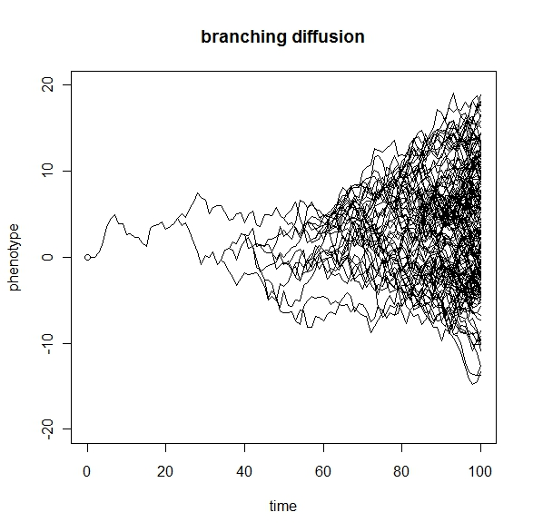

# Doing things with trees is awesome!

*Brownian Motion Simulated with Liam Revell's `phytools`*

### Notes 

- From Pete:
		- A. How to test macroevolutionary ideas while admitting that we can never know the “true” tree
		- Z. But what about X, Y, Z, etc.?
	- Laura: Being able to show something (even if its simple) that one can do whether you made your own tree, generated a supertree, or made most of a tree but want to include 10 taxa you can't code, would be the most broadly useful to the (clearly very mixed experience) group we have coming. From an earlier chat with Davey, he pointed out that we could also instead take the approach of doing a light touch overview of what is now possible in the paleo-PCM world and highlighting the R packages that are available to do it. We could also stick to modelling rates of discrete character change on the tree if switching to continuous characters feels too 'from scratch'.
	- Peter: As Laura noted, those approaches rely heavily on divergence times, which means that you have to rehash (and reinforce!) the FBD & tip-dating material from earlier parts; many PCM approaches integrate over trees, too, which gets back to the MCMC approach.  And both the FBD/tip-dating and methods for assessing how characters evolve over trees get back to the morphological evolution modules.  There could be a lot of “As April / Laura / David / Davey showed us earlier, we do XXX here” parts that could really tie the whole thing together.  And, of course, it would also get back to something you certainly will raise from the start: why we want decent estimations of phylogeny in the first place.
	- Sandy: 
		- Cooper, Natalie, Gavin H. Thomas, and Richard G. FitzJohn. "Shedding light on the ‘dark side’of phylogenetic comparative methods." Methods in ecology and evolution 7.6 (2016): 693-699.
		- https://besjournals.onlinelibrary.wiley.com/doi/full/10.1111/2041-210X.12533
	- Laura: Yup this article highlights important points, there are a couple of others that highlight similar things (e.g. Uyeda). It will be important for us to emphasise that throwing loads of pcms at a single topology in R is not a great idea, but that integrating over tree and trait uncertainly for carefully chosen methods that are appropriate for the question is. 
	- I’d like Davey and I to be able to emphasise their power and necessity, but also the importance of choosing your approach carefully. 
	- April: I think you two have exactly the right approach. It's really easy to get bogged down in the PCM debates. Should we be using BAMM? Does Ohrenstein-Uhlenbeck even work? Those are important questions! But it's probably important that learners walk away with some roadmap to even basic points like which are process-based, and which are more neutral to the underlying evolutionary model? 
		- If you don't want to do a single point estimate tree, how can you avoid that (maybe treeplyr in R for working with tree vectors, co-estimation of  model + tree in RevBayes) see here for an example: 
		- https://revbayes.github.io/tutorials/chromo/ 
	- Peter: What might be done with the cinctan dataset?  Smith & Zamora separated “feeding” characters (or at least food groove characters) from others, and there certainly have been PCM studies contrasting how one class of characters evolves vs. another.  We probably could gather basic size data, too: e.g., dimensions of the theca or whatever you call the “body” of these things.  The benefit of that is that there might be a prize for the 1 millionth tree-based test of body size evolution!  

