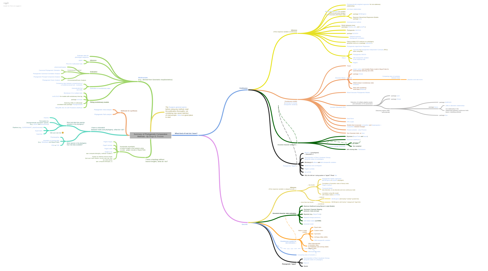
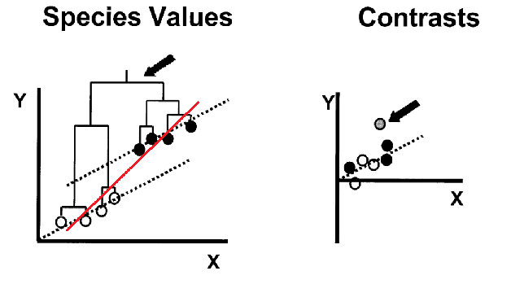
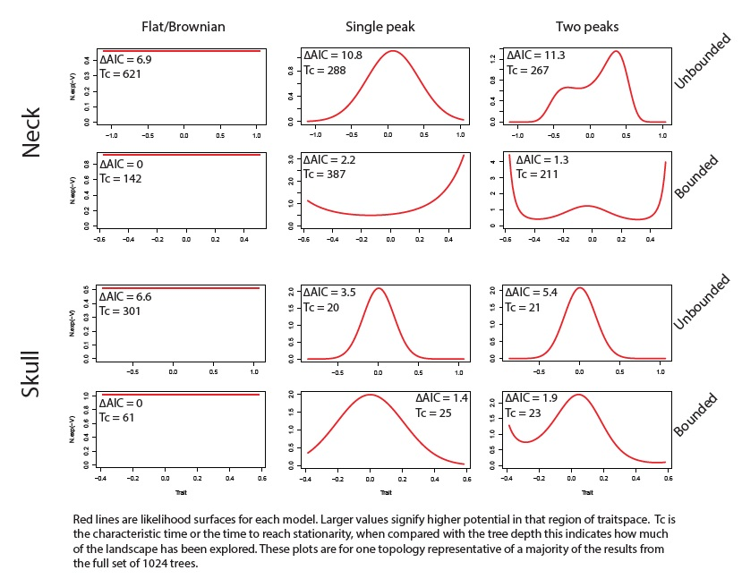

```{r echo=FALSE}
set.seed(1)
```

# Introduction

**What is a PCM?**
The approaches we have been using so far today are focussed on phylogenetic inference, i.e. on estimating the most probable evolutionary relationships between taxa. One of the advantages of a framework that incorporates explicit models of diversification, is that it allows joint inference of various parameters that have traditionally been of interest to paleobiologists, like the rate of origination and extinction through time. As you have seen, it is possible to extract these estimated rates from the output of the analysis. These kinds of approaches - where we model the generating processes of diversification and character change together- can be referred to as process-based. Other types of information (for example biogeography) can also be used in this modelling framework, and as new models are developed the potential questions that can be answered will increase. This framework can be thought of as a phylogenetic comparative method because it can be used to test evolutionary hypotheses about the nature of trait change or diversification. However, process-based models, and particularly their implementation, are a relatively recent development. Prior to this unified framework, there was a clearer distinction between phylogenetic inference (inferring relationships) and PCMs (testing hypotheses while treating the tree as known).

There are many reasons (perhaps particularly for paleobiologists) that it might not be feasible, or of interest, to infer phylogenetic relationships as a means to answer other macroevolutionary questions (i.e. to use a process-based approach). Perhaps you have previously estimated a phylogeny but now want to use it to answer new questions, perhaps you are interested in combining several smaller phylogenies to generate a supertree, or perhaps your specific question is not yet answerable in a Bayesian process-based framework. The good news is that when we have a phylogeny that includes extinct taxa as tips, and it is appropriately scaled to time using the stratigraphic record as an extra source of information, trees constructed in many different ways can be used in PCMs to make reliable inferences about morphological change (@Soul2015). This is far less so the case for trees that only include living species - thumbs up for paleontology!

**This tutorial.** What follows is an overview of some of the approaches that can be used when you already have a tree in hand. These approaches are what people commonly think of as phylogenetic comparative methods, and some of you may already be familiar with them. Many of these PCMs are used to model trait change through time, and the relationship between that trait change and other variables. But, unlike what we have been doing today so far, most do not model the underlying process that generates the trait change, just it's outcome. Therefore, as we will see later, different underlying processes can be best fit by the same model. There is also a large suite of approaches (phylogenetic and non) that can be used to estimate diversification rates, those are more likely to be familiar to paleontologists, so for today we will stick to morphology.

New PCMs have been rapidly proliferating in the past 5-10 years, and the kinds of questions they can be used to rigorously answer is now very diverse. Have a look at [this infographic](https://coggle.it/diagram/WhbkkxE2BAAB0R0m/t/summary-of-phylogenetic-comparative-methods-diogo-b-provete) by Diogo B. Provete to see what we have available to play with! In this tutorial we will start with some fundamental approaches that are conceptually important, and move on to more complex models if there is time, or if you are already familiar with the fundamentals. Multiple books have been written on this vast topic, but hopefully this is enough to get started or understand some of the idiosyncracies of relevant R functions! 



_A tree of approaches that can be applied to trees_

**A note on 'the dark side' of phylogenetic comparative methods.** There are several papers (even a whole MEE edition!) that highlight situations where phylogenetic comparative approaches do not seem to do the job that we would like them too. It is very important to make sure that the method you use is appropriate for your question and data, and that you apply it correctly, but don't let these debates deter you from trying out PCMs. When applied correctly they can be very powerful tools for macroevolutionary inference, and it is often the case that considering phylogeny at all will give you more information than ignoring it. Many of the criticisms boil down to needing to fully understand the method you are implementing, not going too far with conclusions, and doing things like checking that parameter estimates are reasonable. If in doubt, simulation can be a powerful tool to try and characterise the behaviour of a particular method when applied to data similar to your own. In this tutorial we have tried to introduce some ways to establish the robustness of results derived from PCMs.

For the worked example we will be switching to a different dataset, for which we already have a set of trees. They're still echinoderms though! To find out more about the crinoid group Eucladida look at [@Wright2017](https://www.nature.com/articles/s41598-017-13979-9). We will use a variety of PCMs to characterise the evolutionary history of some traits that are relevant to their feeding ecology.

#Getting Started - data and phylogeny

Set the working directory to the one that contains the data files for this tutorial using `setwd()` or the session menu.

Start by loading the packages that we will be using in this session. OUwie has the other packages as dependencies but all packages that we will be using are included here for clarity.

```{r results='hide', message=FALSE, warning=FALSE}
library(ape) #standard format and processing for phylogenies in R
library(nlme) #fitting gaussian models e.g. least squares regression
library(geiger) #versatile package that performs and plots many pcms
library(phytools) #additional plotting and simulation functions
library(OUwie) #fitting Hansen models (discussed later)
```

You can either read in the tree and data objects I prepared earlier using `load("Eucladida_inputs.RData")` Or follow these instructions to format them ready for analysis. Begin by reading in the maximum a posteriori tree. This is to be used **ONLY** as an example, actual analyses should be performed over a set of trees to assess how robust a result is to topology and branch length variation; more on that later.

```{r}
tree <- read.tree("Eucladida_MAP.tre")
```

The output from RevBayes has branch lengths, but if all tips are extinct you should set the root age by adding the final extinction time to the maximum root to tip distance. This is required by some analyses and makes plotting on a timescale easier.
```{r}
tree$root.time <- max(vcv(tree) + 268.8)
```

The code above makes use of the function vcv; when applied to a tree this gives the phylogenetic variance covariance matrix of that tree. The vcv matrix is very important for many PCMs and it is also an intuitive representation of the tree. Elements on the diagonal of the matrix give the variance, when a tree has branch lengths scaled to time (as paleontological trees usually do) then these values give the root to tip distance for each tip on the tree. This can be very useful, for example `max(vcv(tree))` gives the maximum root to tip distance, i.e. the age of the whole tree. The off diagonal elements give the covariance which is the amount of expected shared variance between pairs of taxa. Take a look at the following small example tree and check you can see how it corresponds to the associated vcv matrix.

```{r, echo = FALSE, out.width='50%', warning=FALSE}
t <- rtree(6)
plot(t)
axisPhylo()
round(vcv(t),4)
```

The basic plotting function for phylogeny in R from the package `ape` doesn't always do a great job. Here is a tutorial on using [ggtree](https://4va.github.io/biodatasci/r-ggtree.html) to make nicer tree plots, if you are interested. However, for now just to take a quick look at our tree use:
```{r}
plot(ladderize(tree), show.tip.label = FALSE)
axisPhylo() 
```

You can see that some taxa were inferred to be ancestral to others that are included in the tree. Unlike in IcyTree, R displays these ancestors as sister to their descendants with 0 length branches. For the methods we are about to use zero length branches are mathematically intractable, we will therefore add a very short length to them. If you are concerned about bias this could introduce you could also drop these tips from the tree and compare results, note that in this dataset there are several inferred ancestors so this may represent loss of quite a lot of information. Node labels are required later for `OUwie` so we will add them now too.
```{r}
tree$edge.length[tree$edge.length == 0] <- 0.001
tree$node.label <- rep(1, Nnode(tree))
```

For the purposes of this tutorial our main focus is on modelling change in continuous characters, but there is one discrete character for use later on. The three traits we will be modelling are calyx shape (measured as the length/width ratio of the calyx), fan density (approximate number of proximal feeding appendages an individual of the species has), and calyx complexity (number of plates interrupting the posterior interray), which is a discrete trait that could be ordered or unordered, depending on who you ask.

Read in the data, take the natural log of the shape ratio and assign each trait to an individual vector (this format is required by some functions in `geiger`). Make a table of all taxa for which all three traits are available. Fan density is available for fewer taxa than are included in the tree, so make a pruned tree that only includes the overlapping taxa.
```{r}
#read in data
data <- read.table("Shape_and_CalyxComplexity.txt", 
                   header = TRUE)
Fan_data <- read.table("Fan_density.txt", 
                       header = TRUE)

#log and assign to separate vectors
Shape <- log(data$Shape)
names(Shape) <- row.names(data)
Complexity <- data$Calyx_Complexity
names(Complexity) <- row.names(data)
Density <- Fan_data$Fan_density
names(Density) <- row.names(Fan_data) #this is already a logged value

#drop tips to make smaller tree that matches fan density data
prunedTree <- drop.tip(tree, 
                       setdiff(tree$tip.label, names(Density))
                       )

#make table with no missing data
overlapTaxa <- intersect(row.names(data), 
                         row.names(Fan_data))
allTraits <- data.frame(
  Species = overlapTaxa, 
  Shape = Shape[overlapTaxa], 
  Complexity = Complexity[overlapTaxa], 
  Density = Density[overlapTaxa]
  )
```

# Phylogenetic non-independence

Felsenstein outlined the problem of the non-independence of species trait data, and an algorithm to account for the problem - phylogenetic independent contrasts (PIC) - in 1985 (@Felsenstein1985). The most common evolutionary question that this problem and solution are relevant to is that of the relationship between two traits. The original formulation and explanatory figure have led to this approach being commonly referred to as 'correcting' for phylogeny, which has in turn led to some misunderstandings. Although it is true that without considering phylogeny a comparative analysis of two species variables might be statistically invalid, it might be helpful to think of PIC (and its more general relative phylogenetic generalised least squares (PGLS)) as incorporating the additional useful infomation that phylogeny provides, into the estimation of the relationships between traits. 



_The problem of species non-independence and how standardised phylogenetic independent contrasts resolves this. The red line would be the slope of the ols regression. Adapted from @Nunn2001 _

The problem: The extreme case of the problem of non-independence of species data is shown in the original @Felsenstein1985 paper as well as the example figure above. Basically, there could be a relatively shallow relationship between two traits, but an early split in a clade has lead to species in one part of the tree having overall higher values in both traits than species in the other part of the tree. The early split means that species in the two parts of the tree have been evolving separatetely from one another for a long time, and so have had a long time to accumulate differences between them, species in the same clade are more similar because of their shared evolutionary history. This leads to a regression line that is too steep when all the species data are considered together. Regression analysis assumes that individual data points are statistically independent from one another, this assumption is violated by species data because of shared evolutionary history. PIC is an intuitive approach, it takes the average trait value of sister clades and weights this by the amount of time they have been evolving separately. Most researchers now use phylogenetic generalised least squares (PIC is a special case of PGLS, they are mathematically equivalent when you assume a Brownian motion model of trait change; see the tempo and mode section for an explanation of Brownian motion). After an ordinary least squares (OLS) regression is done on species data, there will be phylogenetic signal that dictates how far each datapoint is from the regression line (its residual), we say therefore that there is phylogenetic structure in the residuals of the regression. PGLS adjusts the regression line so that the residuals are normally distibuted, rather than structured. 

For our worked example we will start by using PGLS. Say we are interested in whether calyx shape correlates with fan density, we could use the pearson correlation co-efficient, or perform an OLS regression:

First of all plot the data!
```{r}
plot(allTraits$Shape, allTraits$Density, 
     pch = 19, main = "", 
     xlab = "Calyx shape ln(L/W)", 
     ylab = expression(paste("ln[Fan density]"," ", "(",Omega,")"))
     )
```

The standard test of correlation between two continuous variables is the Pearson correlation coefficient. Does this test indicate shape and fan density are correlated?
```{r, eval=FALSE}
cor.test(allTraits$Shape, allTraits$Density) 
```

Now run an OLS, what is the slope and intercept of the relationship?
```{r}
ols <- gls(Density ~ Shape, 
           data = allTraits, method = "ML")
```

Now we will fit a phylogenetic least squares regression line, using the same `gls` function as before, but this time including the vcv matrix as the expected structure in the residuals. Generalised least squares regression is a very flexible framework that allows you to supply correlation structure for the residuals of the regression that can be derived from any potential source of non-independence. For example, here we are using phylogeny, but as some traits are known to vary systematically across space, a matrix of expected spatial covariance could also be used.

Note that this model uses two extra arguments. First `correlation` which defines the expected structure in the residuals, in this case based on the phylogeny and a brownian motion model. Trees that have extinct taxa in them and are scaled to time are referred to as 'non-ultrametic', in contrast to 'ultrametric' trees where all the tips end simultaneously at the present day as is the case with trees of living taxa. The argument `weights` is a modification to account for the different root to tip distances in our non-ultrametric tree - important for paleontologists.

```{r}
tip.heights <- diag(vcv(phy=prunedTree))
cor.BM <- corBrownian(phy=prunedTree)
pgls <- gls(Density ~ Shape, 
            correlation = cor.BM, 
            weights = varFixed(~tip.heights), 
            data = allTraits, 
            method = "ML"
            )
```

Now that we have fit both OLS and PGLS we can compare them using the Akaike Information Critereon (AIC) to see which is a better model for the data. When there is low or no phylogenetic signal in the residuals of the regression then ols will be the better model as it has fewer parameters.  We can check the AIC scores with the output of the `gls` function that we stored in the objects ols and pgls. Which is a better model for our crinoid data?

```{r, eval=FALSE}
summary(ols)$AIC
summary(pgls)$AIC
```

We can plot the data again and look at the two different regression lines. If PGLS is a better model we would expect any new specimens discovered to fall somewhere closer to the PGLS regression than the ols.

```{r}
plot(allTraits$Shape, allTraits$Density, 
     pch = 19, main = "", 
     xlab = "Calyx shape ln(L/W)", 
     ylab = expression(paste("ln[Fan density]"," ", "(",Omega,")"))
     )
abline(ols$coefficients)
abline(pgls$coefficients, lty = "dashed")
```

There is repeated discussion on whether or not researchers should or should not 'correct for phylogeny' in a particular analysis. In the context of analyses like regression or ANOVA to understand trait correlations and adaptation, the key thing to bear in mind is that if there is phylogenetic signal in the **residuals** then the resulting relationship derived is statistically invalid because the assumption of independent data has been violated. Phylogenetic signal in any of the individual traits under investigation does not necessarily mean the residuals will have phylogenetic structure, or vice versa. Liam Revell's 2010 paper provides a thorough explanation of this issue @Revell2010. If in doubt, rather than using 'corBrownian' you can use 'corPagel' to define the correlation structure, this will jointly esitmate lambda which is a measure of the phylogenetic signal in the residuals. As lambda gets closer to 0 the estimated coefficients in pgls will converge on those estimated using ols. Also bear in mind that all models are wrong, but some are more wrong than others, and in this case to do a non-phylogenetic analysis is equivalent to assuming the phylogeny is a star.


#Tempo and mode - Brownian motion and more

Explicitly modelling morphological change provides a framework with which we can quantitatively test hypotheses about macroevolution. Through models we can link evoluionary histories of groups to different biotic or abiotic factors and link patterns in morphological evolution to concepts like convergence, contstraint, evolutionary radiations and the adaptive landscape. In this section we will explore the models that form the foundation of many phylogenetic comparative methods. 

First of all, lets take a look at our tree plotted as a traitgram in 'phylomorphospace' this basically just means that the y axis is meaningful (the trait value) rather than when we usually show trees where the branching order but not the position of the tips matters. The `phenogram` function requires that the tree and trait have matching taxa and the trait vector has names corresponding to the tree tip labels (i.e. taxon names).

```{r}
#ftype controls how the taxon names are displayed
phenogram(prunedTree, Density, ftype = "off") 
phenogram(tree, Shape, ftype = "off") 
```

This function is from the package 'phytools'. Positions of the tips on the y axis are just the trait values, the positions of the nodes are estimated assuming Brownian motion, they should not be considered rigorous estimates of ancestral trait values, at this stage they are just for visualisation.

##Brownian motion

Brownian motion (sometimes known as a 'random walk' model of evolution) is a model that can be used to describe the expected variance of a trait along branches of a phylogeny through time. It is called a random walk because the direction and amount of change in each time step is independent of the direction and amount of change in the previous time step. The amount of change expected in each time step (the step rate, referred to by the model parameter sigma \(\sigma\)) is constant over time, so the trait variance across the tips of the phylogeny increases over time. The model assumes no directionality of trait change, so there is a phylogenetic trait mean (referred to by the model parameter theta) that is also the trait value for the ancestral node of the phylogeny. Trait values of lineages wander around this phylogenetic mean through time. The longer a branch on the tree is, the greater potential there is for change in the trait value, and the less time it is since two branches split from a common ancestral branch the more similar they are expected to be because there has been less time for them to accumulate change and therefore difference between them. The name 'random walk' is perhaps a little misleading, on macroevolutionary timescales it is not random in the sense that genetic drift might be considered random, the change over time is most likely as a result of the combination of selection acting on the trait as well as genetic drift, and the direction of selection might fluctuate over time as a result of different causes. It is therefore best thought of as a stochastic model for patterns of character change. For other explanations of Brownian motion on phylogenies see @Nunn2011 or @Harmon2019.

We will begin by fitting Brownian motion models to both of our continuous traits using a function from the `geiger` package.

```{r}
densityBM <- fitContinuous(phy = prunedTree, 
                           dat = Density, model = "BM")
shapeBM <- fitContinuous(phy = tree, 
                         dat = Shape, model = "BM")
```

Take a look at the outputs `densityBM` and `shapeBM`. What is the estimated rate of evolution? What is the phylogenetic mean trait value (equivalent to the ancestral state at the root of the tree)?

##And more - alternative models of trait change

It is reasonable to think that a random walk model of evolution might not be an adequate description of patterns of morphological variation over millions of years. As paleontologists we can think of many examples when patterns in the fossil record suggest periods of constraint or rapid increases in morphological disparity. Fortunately there is a straightforward framework that extends the Brownian motion model and can be used to model these kinds of patterns. The most commonly implemented alternative model is one that can be used to describe stabilising selection - the Ornstein-Uhlenbeck model. In this model there is an additional parameter - alpha \(\alpha\). Theta still is in the model but now it can more appropriately be thought of as the optimum value for the trait. There is still a random walk included, the actual value of the trait varies along branches, but it is biased towards getting closer to the optimum, the strength of that bias or attraction towards the trait optimum is \(\alpha\). Unlike in pure Brownian motion the variance does not increase linearly with time, traits evolving under OU will therefore be less tightly linked to the structure of the phylogeny, in other words they will have less phylogenetic signal. 

Aside from OU, other models you may have heard of are 'Early Burst' or 'ACDC', those are models where the step rate \(\sigma\) changes through time. A Brownian motion with a trend model is identical to Brownian motion except that each evolutionary change per step is consistently biased in one direction.

Lets take a look at some simulations to get a better sense of what trait evolution on a phylogeny might look like under these different models. Try changing sig2 (sigma squared) the evolutionary rate parameter to see what happens.
```{r}
simtree <- rtree(50)
bmsim <- bmPlot(tree = simtree, 
       type="BM", 
       anc=0, 
       sig2=0.01)
hist(bmsim$x[1:50],
     xlab = "Trait values",
     main = "Simulated values at tips"
     )#Look at the tip values
```


The above plot shows changing trait values in discrete time steps for the whole history of the clade. Normally we would only know the values at the tips, and be dealing with continuous time, so instead we can look at a phenogram.  This time we will simulate both BM and OU. see what happens when you change each of the model parameters? Try making the optimum value theta different from the starting trait value at the root.
```{r}
simtree <- tree
BM <- rTraitCont(phy = simtree,
                 model = "BM",
                 sigma = 0.1)
phenogram(tree = simtree,
          x=BM,
          ftype = "off")
OU <- rTraitCont(phy = simtree,
                 model = "OU",
                 sigma = 0.1,
                 alpha = 0.1,
                 theta = 0,
                 root.value = 0)
phenogram(tree = simtree,
          x=OU,
          ftype = "off")
```

Now that we've used simulations to get a sense of the effect of the specified model and each model parameter on the shape of the trait distribution let's try fitting some models to our real data.

First fit OU models to each trait
```{r, warning=FALSE}
densityOU <- fitContinuous(phy = prunedTree, dat = Density, model = "OU")
shapeOU <- fitContinuous(phy = tree, dat = Shape, model = "OU")
```

Then fit an early burst model
```{r, warning=FALSE}
densityEB <- fitContinuous(phy = prunedTree, dat = Density, model = "EB")
shapeEB <- fitContinuous(phy = tree, dat = Shape, model = "EB")
```

Look at the paramater values for each model fit, are they biologically reasonable? (You should get a warning for one of them, which is a first indicator that the parameter or model might not be a good one for the data) Checking parameter estimates is an important step, particularly because for OU models the different parameter estimates can interact with each other. 

I have turned off the warnings here but if you take a look at them you will see that OU gives a warning about using the vcv matrix. In the original version of this function, to fit OU quickly, the algorithm rescaled the branch lengths, this is problematic for non-ultrametic trees so now this and other functions modify the variance-covariance matrix directly to avoid the issue. Almost all PCMs (especially commonly used ones) can be applied to non-ultrametric trees using R implementations, but this is a good reminder that it is important to check.

**Something to think about** If there are errors (relative to actual evolutionary relationships) in the tree topology we are using, what kind of model will this bias our analyses towards? What about error in the trait measurements? Silvestro et al. show with simulation that incorporating an estimate error should be a priority, and that not doing so in general biases towards OU as the best fit model even when trait change was simulated as BM (@Silvestro2015b).

Now that we have checked to see whether the parameter estimates for the various models are reasonable, look at the AICcs, which is the best fit model for each of the traits?

```{r, eval=FALSE}
densityBM$opt$aicc
densityOU$opt$aicc
densityEB$opt$aicc

shapeBM$opt$aicc
shapeOU$opt$aicc
shapeEB$opt$aicc
```

#Varitaion across trees

In the previous exercises we have been using the maximum a posteriori tree as the phylogenetic framework. However, all the exercises that you did earlier resulted in a posterior distibution of trees. Given that none of us expect that the maximum a posteriori tree perfectly represents evolutionary truth, it is important to get some measure of the robustness of our results to variation in topology and branch lengths. This is true whatever approach is used to infer the tree topology and branch lengths; using a point estimate of the tree is never recommended. The easiest way to understand how important variation across trees is for your result, is to run the analysis over a set of different trees. Here we will randomly select 100 from the posterior distribution. Other commonly used sizes for tree sets are 500 and 1000, really it is arbitrary and at the researchers discretion as to how large a set of trees they need to include in order to fully characterise the variation in results. If you haven't used a Bayesian inference approach you could select a set of trees from the MPTs, and/or a set of trees from the output of a timescaling algorithm to understand the effect of branch length variation.

Load the post burnin posterior set of trees and select a subsample of them, add a root age and extend zero length branches as before
```{r}
trees <- read.tree("Eucladida_postBurnIn.tre")
treeset <- trees[sample(1:5000, 100, replace = FALSE)]
root.time <- 268.8
for (i in 1:length(treeset)){
	treeset[[i]]$root.time <- max(vcv(treeset[[i]])) + root.time
}
```
Choose one of the previous analyses and run it over the entire treeset. How much variation is there? How much confidence do you now have in the result you obtained previously?

For example you could fit BM to each tree (warning this could take a while)
```{r, eval=FALSE}
sigmas <- vector(length=100)
for(i in 1:100) {
    currentTree <- treeset[[i]]
    fitBM <- fitContinuous(phy = currentTree, 
                         dat = Shape, model = "BM")
    sigmas[i] <- fitBM$opt$sigsq
}

#look at the variation in the estimate of the evolutionary step rate parameter across trees
hist(sigmas)
```

Once analyses have been run over the treeset the results should be summarised appropriately. There is not yet a universally agreed upon way to do this, but in general, approaches such as displaying median values with the variation around them (as long as it is made clear that this variation is separate from the error or confidence intervals on the results themselves), showing model support across trees in a bar plot, or showing a representative result and discussing how robust it is, have been used in the literature. Some methods do have built in ways of summarising across sets of trees (see for example `rjmcmc` in `geiger`), but this is rare.


#Model fit and model adequacy

Much of what we have just done involved fitting models of evolution to data, by estimating the maximum likelihood parameter values for a particular model, given the data. We then compared the AIC scores of each model fit to see which was the best fit model, and what that might tell us about evolution of the clade in question. However, just because one model is a better fit than the other models that were tested, it does not necessarily mean that it is a good model. To quote Matthew Pennell "All models are wrong and sometimes even the best of a set of models is useless". With simple models like regression, taking steps like plotting the data or looking at the residuals can help establish how good the model is, but with more complex approaches (i.e. most phylogenetic comparative methods) visualisation is unlikely to help. There are not well established model adequacy testing approaches (although see [Arbutus](https://www.journals.uchicago.edu/doi/10.1086/682022) for trees where all tips are extant). One possible solution is to use simulation for 'posterior prediction' (this is what Arbutus does for phylogenies of extant taxa). This approach can be applied to paleontological trees as well, although the mechanics are slightly different. 

1) Find the best fit model
2) Identify the model parameters 
3) Use these parameters to repeatedly simulate trait change under the best fit model on the original phylogeny
4) Calculate the standardised independent contrasts of the original data and all the simulated data
5) Compare test statistics of the contrasts from the real data and distribution of simulated data.
6) If real data test statitics fall within the distributions of simulated test statistics the model is adequate

For example, was the OU model that earlier we found was the best out of the models we fit to our shape data, actually a good model?

```{r}
alpha <- shapeOU$opt$alpha
sigma.sq <- shapeOU$opt$sigsq
theta <- shapeOU$opt$z0

shapeData <- data.frame(species = names(Shape), 
                        regime = 1, shape = Shape)

simtrait <- replicate(100, 
                      OUwie.sim(phy = tree, 
                                data = shapeData[,1:2], #This just gives the tips and regime, no data
                                root.age = tree$root.time, 
                                alpha = c(alpha,alpha), 
                                sigma.sq = c(sigma.sq,sigma.sq), 
                                theta = c(theta,theta), 
                                theta0 = theta
                                )
                      $X)

rownames(simtrait) <- shapeData[,1]
realContrasts <- pic(phy = tree, x = Shape)
simContrasts <- matrix(nrow = 100, ncol = 81)


```

#Choose your own adventure

As I mentioned right at the beginning of the tutorial there are now **a lot** of different phylogenetic comparative approaches that can be applied to treesets to answer a diversity of questions.

If you have gotten this far, please check that your table companions are not in need of assisstance. Then investigate one of the following approaches; there is only a full working example for modelling discrete traits using `geiger` and for multi-regime models in `OUwie`, but the instructors have example code for several of the other approaches if you are interested.

##Post-hoc modelling of discrete characters

If a discrete trait is inluded in the phyloegnetic inference analysis then rates and ancestral states can be jointly estimated as with other parameters. However, if you have a tree already and want to characterise a discrete trait that was not included in the inference analysis then you can use `geiger` similarly to how we used it to fit continuous traits earlier. 

First fit a model with a single parameter for all transition rates
```{r}
ER <- fitDiscrete(tree, dat = Complexity, model = "ER")
```
Then a model where each rate is a unique parameter
```{r}
ARD <- fitDiscrete(tree, dat = Complexity, model = "ARD")
```
Given that this is a multistate character, you might think (as some echinoderm workers do) that the character is ordered so that transitions can only occur between consecutive states. In this case you can use the `meristic` model
```{r, warning=FALSE}
MER <- fitDiscrete(tree, dat = Complexity, model = "meristic")
```

As with previous model fits we can check the AICcs to see which model fits our data better.
```{r, eval=FALSE}
ER[[4]]$aicc
ARD[[4]]$aicc
MER[[4]]$aicc
```
It is also straightforward to reconstruct ancestral states, this assumes an equal rates model. Phytools has useful functions for plotting the likelihood of a given state onto the tree.
```{r}
anc.char <- ace(Complexity, tree, type = "discrete")
plot(ladderize(tree), show.tip.label = FALSE)
nodelabels(pie = anc.char$lik.anc, 
           piecol = c("lightblue","darkblue", "salmon", "darkred"), 
           cex = 0.5
           )
```

_Pie charts plotted on each node showing the likelihood the trait is in each state at that node_

## Multi-regime OU models

As we saw above, Ornstein-Uhlenbeck models have three or four parameters that define an 'adaptive peak'. This can also be thought of as a macroevolutionary regime; for some period of time the evolution of a set of taxa can be characterised using single estimates for those parameters, and though the actual mechanisms generating the observed patterns may vary through time, they have the same outcome. This model is consistent with Simpson's concept of the adaptive landscape. Often we would not expect that a clade would remain in the same macroevolutionary regime (i.e. where the same trait value is optimal and the strength of \(\alpha\) (the constraint parameter) remains the same) over the many tens of millions of years of its evolutionary history, or that all branches of a clade would experience the same regime. We might also be interested in how the regime a clade experiences might relate to factors like environmental change.

Fortunately it is possible to model shifts in the evolutionary regime through time, by estimating new parameter values for different sections of the phylogeny. The package `OUwie` has model fitting and trait simulaiton functions for this. It requires a priori definition of clade or time regime shift points, it is therefore suitable for hypothesis testsing. See also packages `mvMorph`, `mvSLOUCH`, `OUCH` and `ape`.

`OUwie` can be used to fit models where one or more of the rate of evolution, strength of alpha or trait optimum value can change at shift points.

Multi-regime OU models can be very complex, and are therefore often difficult for the function to fit. It is **especially** important that you check the parameter values when you use this function, to make sure that they are sensible. For example if you get values for \(\theta\) or theta_0 that are outside the known range of trait values, or get unreasonably high values for the amount of expected evolutionary change per step \(\sigma\). Looking to the literature for rates that might be reasonable for your trait could also help.

The following example uses the same crinoid data that we have been using previously, with possible regime shift points based on Davey's prior knowledge as a crinoid systematist & taxonomist familiar with their morphology and ontogeny, derived from previous experience and knowledge of the published literature. When choosing possible shift points for your own trees, it will be helpful to relate them to specific hypotheses about factors that may have effected their evolutionary history (e.g. novel adaptation, dispersal to a new region, environmental change like sea level fall).

OUwie has a very specific format required for the input data. It requires a three column data frame where the first column is the taxon names, the second is the regime each tip is in (this can be overwritten later by defining a clade that has its own regime using the 'clade =' argument, see script below) and the third column is the trait data. You can optionally give a fourth column with the standard error of the trait measurements (this means an estimate of the intraspecific error if you have multiple specimens, plus measurement error), this is adviseable whenever it is possible. The tree must have internal node labels corresponding to the regime, again this can either be set in advance, or overwritten using the 'clade =' argument within the function. If set in advance you must set two or more regimes even if you are going to fit a single regime model where these will be overwritten, or you will get an error.

First set up data frame and tree correctly
```{r}
shapeData <- data.frame(species = names(Shape), 
                        regime = 1, shape = Shape)
densityData <- data.frame(species = names(Density), 
                          regime = 1, density = Density) #gets overwritten with correct labels later
tree$node.label <- sample(c(1,2), 
                          Nnode(tree), replace = TRUE) 
prunedTree$node.label <- sample(c(1,2), 
                                Nnode(prunedTree), replace = TRUE)
```

`OUwie` has several options for models, you can allow the strength of the selection parameter \(\alpha\) to shift, the trait optimum \(\theta\), or the evolutionary rate \(\sigma\), you can also fix or vary different combinations of these for each regime.

We will start by using the function to estimate brownian motion and OU parameters applied to the whole of the tree, for both shape and density, as we did previously using the `fitContinuous` function in `geiger`. As an argument in the function you must also provide the time of the root of the tree with `root.age=`, because this tree does not end at the present day. You can optionally provide starting values, often there is no problem but sometimes without them the function can have difficulty estimating parameters for the models (especially if the models do not fit the data well). This was the case here for the OU models. Ideally you would start the algorithm from a variety of values to make sure that it converges on the same parameter estimates, and not local optima. The argument `root.station` says whether the algorithm should estimate theta_0 the starting state (trait value) should be estimated as part of the model. Sometimes estimates of theta_0 and \(\alpha\) can interact, setting `root.station = TRUE` means that the starting state is not estimated, this can stabilise estimates of the adaptive optimum theta. If you have reason to think there may be a trend (different starting and optimum trait means) then include theta_0 but be sure to check that the final parameter estimates are sensible. It can be sensible to check the results with both and compare.

Does `OUwie` give the same parameter estimates that the other function in `geiger` did for single regime models? What difference does specifiying error make?
```{r, message=FALSE, warning=FALSE}
shapeBM <- OUwie(phy = tree, data = shapeData, 
                 model = "BM1", root.station = FALSE, 
                 quiet = TRUE,
                 root.age = tree$root.time)
shapeOU <- OUwie(phy = tree, data = shapeData, 
                 starting.vals = c(0.01,0.01), 
                 quiet = TRUE,
                 model = "OU1", root.station = FALSE, 
                 root.age = tree$root.time)
densityBM <- OUwie(phy = prunedTree, data = densityData, 
                   model = "BM1", root.station = FALSE, 
                   quiet = TRUE,
                   root.age = tree$root.time)
densityOU <- OUwie(phy = prunedTree, data = densityData, 
                   starting.vals = c(0.01,0.01), 
                   quiet = TRUE,
                   model = "OU1", root.station = TRUE, 
                   root.age = tree$root.time)
```

Now lets look at a multi-peak model. There are two subclades within the tree that seem to show many modifications associated with building a dense filtration fan (e.g. many branches per arm or many pinnules on branches). We can test whether this high density of the fan was associated with a different trait mean or rate of evolution. In this example we will define the tip and node regimes ourselves beforehand because it involves more than one clade. If we hypothesise a rate shift in only one clade it is easiest to use the `clade=` argument withinthe `OUwie` function.

```{r}
#find node defining first clade
mrca1 <- getMRCA(prunedTree, c("Blothrocrinus", "Hydreionocrinus")) 
#make a vector of all descending nodes and tips
first <- c(mrca1, getDescendants(prunedTree, mrca1)) 
mrca2 <- getMRCA(prunedTree, c("Pirasocrinus", "Zeacrinites"))
second <- c(mrca2, getDescendants(prunedTree, mrca2))
#combine clade vectors
desc <- union(first, second) 
#separate into tip and node vectors
tips <- prunedTree$tip.label[desc[desc<=Ntip(prunedTree)]] 
nodes <- desc[desc>Ntip(prunedTree)]-Ntip(prunedTree)
treeD <- prunedTree
treeD$node.label <- rep(1, Nnode(treeD))
treeD$node.label[nodes] <- rep(2, length(nodes))

regimetableD <- densityData
regimetableD[tips,2] <- 2

```

We have prepared the tree and table so that they have the regimes defined appropriately for our question, now we can fit a variety of models. Here I have dropped theta_0 from the model, if you want to you can add it back in using `root.station=FALSE` to see whether it makes a difference, but remember to check for sensible parameter estimates.

```{r, warning=FALSE, message=FALSE}
high_densityBMS <- OUwie(phy = treeD, data = regimetableD, 
                         model = "BMS", root.station = TRUE, 
                         quiet = TRUE,
                         root.age = tree$root.time)
high_densityOUM <- OUwie(phy = treeD, data = regimetableD, 
                         starting.vals = c(0.01,0.01), 
                         model = "OUM", root.station = TRUE, 
                         quiet = TRUE,
                         root.age = tree$root.time)
high_densityOUMV <- OUwie(phy = treeD, data = regimetableD, 
                          starting.vals = c(0.01,0.01), 
                          model = "OUMV", root.station = TRUE, 
                          quiet = TRUE,
                          root.age = tree$root.time)
high_densityOUMA <- OUwie(phy = treeD, data = regimetableD, 
                          starting.vals = c(0.01,0.01), 
                          model = "OUMA", root.station = TRUE, 
                          quiet = TRUE,
                          root.age = tree$root.time)
#this is a complex model and may not be fit well
high_densityOUMVA <- OUwie(phy = treeD, data = regimetableD, 
                           starting.vals = c(0.01,0.01), 
                           model = "OUMVA", root.station = TRUE, 
                           quiet = TRUE,
                           root.age = tree$root.time) 
```
Now take a look at the AICcs and the parameter estimates as you did for the simple model. Which is the best fit model, and what is the AICc difference from the next best model? What are the parameter estimates and what does that suggest to us about the evolution of fan density in this group?

####Using another trait to define regimes
If you are interested in how a particular discrete state has influenced the evolution of other traits, then you can use `OUwie` for this too. If the discrete trait is distributed over the tree rather than being confined to particular clades then you can use any ancestral state reconstruction approach to reconstruct the state at each node, and use the different states to define the regimes on the tree. For a great worked example of this approach see Sam Price's tutorial [here](http://treethinkers.org/tutorials/state-dependent-diversification-of-traits/).

## Estimate rates on individual branches
Similarly to the relaxed clock models for character change that you discussed and implemented earlier today, it is possible to model change of a particular continuous trait on the phylogeny with potentially different rates on each branch or pulses in rate along individual branches using an MCMC sampler in the function `rjmcmc.bm` in `phytools`. For an example of this approach applied to paleontological data see Soul & Benson 2017.


_Different rates on each branch, from @Soul2017 _

##OU without a priori shifts

The package `surface` can be used to estimate OU parameters jointly with regime shift points, using maximum likelihood. However, be warned, surface has been shown to be biased towards more complex models because the AIC (which is used by the shift point estimation algorithm to assess whether adding or removing new regimes provides a better fit) does not penalise additional parameters enough. It is possible to use a similar approach but substitute AIC for BIC which penalises appropriately in this scenario.

##A general model for estimating macroevolutionary landscapes

A fairly new approach that has not yet been widely implemented (so use with caution!), particularly not for paleontological trees, is to use a Fokker-Plank-Kolmogorov (FPK) model. This is a flexible modelling framework that can be used to estimate the shape of a macroevolutionary landscape that has one or more optima, using a parameter called the 'evolutionary potential'. This framework is distinct from the multi-peak OU models above where switches between macroevolutionary regimes are modelled; instead it fits a model of trait change in a single macroevoluionary regime, but that regime can have multiple optima, and be bounded or unbounded. When there is one peak this model is the same as an OU model. This model can be extended to define many different shapes of macroevolutionary landscape. A tutorial showing how to use R to fit the model can be found on github [here](https://github.com/fcboucher/BBMV/blob/master/Tutorial-BBMV.md).



_An example of landscapes estimated with FPK_

##Some helpful introductory resources

Until relatively recently introductory explanations of PCMs were virtually non-existant. Now there are a few, and all come with online versions or supporting resources for applying the methods.

Although it is focussed on anthropology Charles Nunn's book 'The comparative approach in evoluionary anthropology and biology' might be the best true introductory text, low on equations and includes excellent figures. Companion website [AnthroTree](https://wiki.duke.edu/display/AnthroTree/The+AnthroTree+Website).

Luke Harmon's freely availiable book 'Phylogenetic Comparative Methods' covers all the basics then goes into a little more detail.

Modern Phylogenetic Comparative Methods and Their Application in Evolutionary Biology is comprehensive albeit expensive, and is somewhat focussed on approaches relevant to molecular trees although there is a David Bapst chapter at the very end for the paleontologists!

###References for other new methods

BioGeoBears
Levy Models
Bokma models
Threshold model


#References
