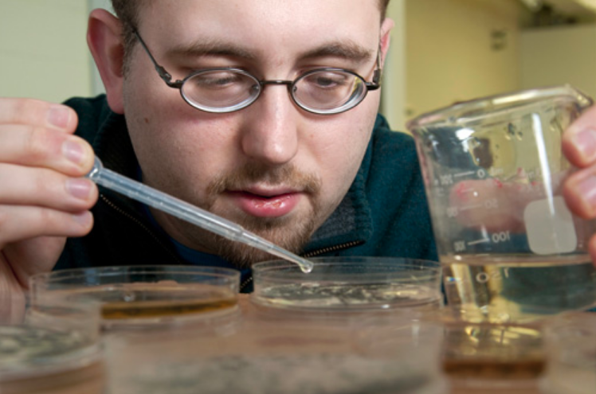

This course is organized by Sandra Carlson & Peter Wagner, with instructors/co-organizers April Wright, Laura Soul, David "Davey" F. Wright, and David Bapst, with instructional material development from Rachel Warnock.

Additionally, this course utilizes a number of assistant instructors called 'helpers', who will be roving the room to help learners who are having issues, while an instructor (one of the people above) lectures and does exercises . Our helpers are just as integral to our short course being successful as our instructors - perhaps even *more* important!

Our current roster of helpers (as of Sept 17th), and their contact information:

- William Gearty [Email](mailto:wgearty@unl.edu), [Github: willgearty](http://github.com/willgearty) 
- Selina Cole [Email](mailto:scole@amnh.org), [Github: Leptaena](http://github.com/Leptaena) 
- Bethany Allen [Email](mailto:eebja@leeds.ac.uk) 
- John Sime [Email](mailto:sime@sas.upenn.edu)
- Phil Novack-Gottshall [Email](mailto:pnovack-gottshall@ben.edu), [Github: pnovack-gottshall](http://github.com/pnovack-gottshall) 
- David Mertz [Email](mailto:damertz@huskers.unl.edu), [Github: DavidAAMertz](http://github.com/DavidAAMertz)
- Greg Liggett

Please give our helpers a big thanks for their volunteered assistance in making our short course a success!

## Meet Your Organizers

Below is some information about your organizers! This area is still a little under construction.

### Sandra Carlson

email 

photo

bio

link to institutional website

github profile

### Peter Wagner

email 

photo

bio

link to institutional website

github profile

(@PeterJWagner3)

### April Wright

email 

photo

bio

link to institutional website

github profile

@wrightaprilm

### David Wright

email 

photo

bio

link to institutional website

github profile

@daveyfwright

### Laura Soul

email 

photo

bio

link to institutional website

github profile

@laurasoul

### David Bapst

{#id .class width=50% height=50%}

David Bapst is an assistant instructional professor at Texas A&M University, where he teaches both on-ground and online classes involve teaching how to do data analysis in R to geoscientists. He is also a certified Software Carpentry instructor and regularly co-organizes and instructs Software Carpentry workshops at TAMU. His research usually involves phylogenies, R, graptolites, and a deep desire to prove that sampled ancestors are real, and you really can talk about them. Really!

Dave has a nice department photo taken recently buts it's not online yet, and he doesn't like the current one. So instead you get the standard seven year old picture of him as a graduate student with some graptolites in a petri dish. Its been a long time since Dave dissolved graptolites out of a limestone though... too long...

You can contact Dave by email at my [gmail](mailto:dwbapst@gmail.com) or my [institutional account at A&M](mailto:dwbapst@tamu.edu).

####Links:
- [Github Profile: dwbapst](https://github.com/dwbapst)
- [Dave's Faculty Page at Texas A&M University](https://geogeo.tamu.edu/people/faculty/bapstdavidwilliam)
- [David's Palaeocast Interview about Graptolites](http://www.palaeocast.com/episode-71-graptolites/) *(The interviewer is fellow organizer, Laura Soul!)*

## Rachel Warnock

email 

photo

bio

link to institutional profile

github profile

@rachelwarnock)

