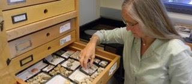

This course is organized by Sandra Carlson & Peter Wagner, with instructors/co-organizers April Wright, Laura Soul, David "Davey" F. Wright, and David Bapst, with instructional material development from Rachel Warnock.

## Our Helpers

This course utilizes a number of assistant instructors called 'helpers', who will be roving the room to help learners who are having issues, while an instructor (one of the people above) lectures and does exercises . Our helpers are just as integral to our short course being successful as our instructors - perhaps even *more* important!

Our current roster of helpers (as of Sept 17th), and their contact information:

- William Gearty [Email](mailto:wgearty@unl.edu), [Github: willgearty](http://github.com/willgearty) 
- Selina Cole [Email](mailto:scole@amnh.org), [Github: Leptaena](http://github.com/Leptaena) 
- Bethany Allen [Email](mailto:eebja@leeds.ac.uk), No Github? 
- John Sime [Email](mailto:sime@sas.upenn.edu), No Github?
- Matthew E. Clapham [Email](mclapham@ucsc.edu), [Gihub: mclapham](http://github.com/mclapham)
- Phil Novack-Gottshall [Email](mailto:pnovack-gottshall@ben.edu), [Github: pnovack-gottshall](http://github.com/pnovack-gottshall) 
- David Mertz [Email](mailto:damertz@huskers.unl.edu), [Github: DavidAAMertz](http://github.com/DavidAAMertz)
- Daniel Killam [Email](daniel.e.killam@gmail.com), No Github?

Please give our helpers a big thanks for their volunteered assistance in making our short course a success!

## Meet Your Organizers

Below is some information about your organizers! This area is still a little under construction.

### Sandra Carlson

{#id .class width=50% height=50%}

Sandy Carlson is a Professor at the University of California, Davis, in the Department of Earth and Planetary Science where she has been teaching for a long time. She is obsessed with brachiopods, and has spent decades trying to understand as much about them as she can. She currently chairs the Paleontological Society Government Affairs committee, and is committed to promoting the role of science and scientists in public policy. She is also the Director at UC Davis of a UC-system-wide program that encourages STEM undergraduates to pursue careers as K-12 teachers — the world needs more great math and science teachers!

#####Links
- [Email Sandy](mailto:sjcarlson@ucdavis.edu)
- [Sandy's Departmental Website](http://www.geology.ucdavis.edu/faculty/carlson.html)

### Peter Wagner

photo

Pete’s interest in phylogenetic methods stem the twin goals of deriving better phylogenetic methods for supposedly character-poor systems such as gastropod shells and finding tree-based approaches that simultaneously assess phylogeny & macroevolutionary models.

#####Links

link to institutional website

github profile (PeterJWagner3)

email 

### April Wright

photo

bio

#####Links

link to institutional website

github profile (@wrightaprilm)

email

### David Wright

{#id .class width=50% height=50%}

Davey is interested in ways phylogenetic methods can be used to better understand the origin, morphologic evolution, and diversification of major lineages of echinoderms, especially crinoids. He's currently a postdoctoral researcher at the American Museum of Natural History and was previously a Peter Buck Fellow at he National Museum of Natural History (Smithsonian Institution). 

When he's not thinking about echinoderms or obsessing over phylogenies, he regales himself with natural history, birding, punk rock music, baseball, Vonnegut novels, craft beer, and NYC pizza.

#####Links
- [Email Davey](mailto:dwright@amnh.org) 
- github profile (@daveyfwright)
- [Davey's Personal Website](https://daveyfwright.wordpress.com)

### Laura Soul

{#id .class width=50% height=50%}

Laura is interested in understanding the behaviour of phylogenetic methods when applied to the fossil record, and how pcms can be applied to understand drivers of tetrapod evolution, particularly Sauropterygian marine reptiles.

#####Links

- [Github Profile: laurasoul](https://github.com/laurasoul)
- email 
- link to institutional website

### David Bapst

{#id .class width=50% height=50%}

David Bapst is an assistant instructional professor at Texas A&M University, where he teaches both on-ground and online classes involve teaching how to do data analysis in R to geoscientists. He is also a certified Software Carpentry instructor and regularly co-organizes and instructs Software Carpentry workshops at TAMU. His research usually involves phylogenies, R, graptolites, and a deep desire to prove that sampled ancestors are real, and you really can talk about them. Really!

Dave has a nice department photo taken recently but it's not online yet, and he doesn't like the current one. So instead you get the standard seven year old picture of him as a graduate student with some graptolites in a petri dish. Its been a long time since Dave dissolved graptolites out of a limestone though... too long...

You can contact Dave by email at his [gmail](mailto:dwbapst@gmail.com) or his [institutional email account at A&M](mailto:dwbapst@tamu.edu).

#####Links

- [Github Profile: dwbapst](https://github.com/dwbapst)
- [Dave's Faculty Page at Texas A&M University](https://geogeo.tamu.edu/people/faculty/bapstdavidwilliam)
- [David's Palaeocast Interview about Graptolites](http://www.palaeocast.com/episode-71-graptolites/) *(The interviewer is fellow organizer, Laura Soul!)*

### Rachel Warnock

photo

bio

link to institutional profile

github profile (@rachelwarnock)

email 
